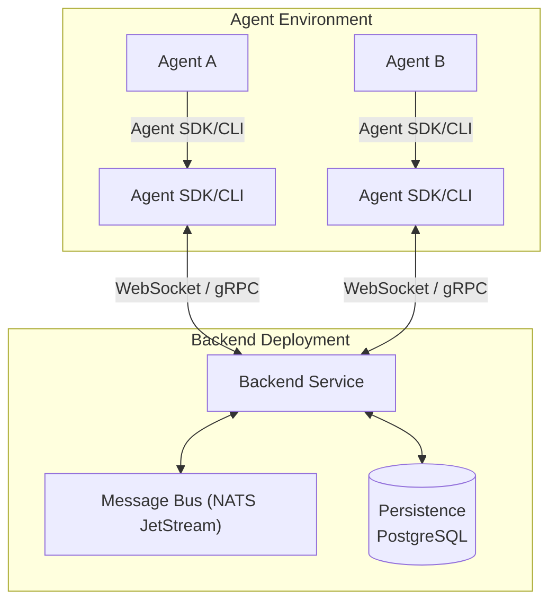
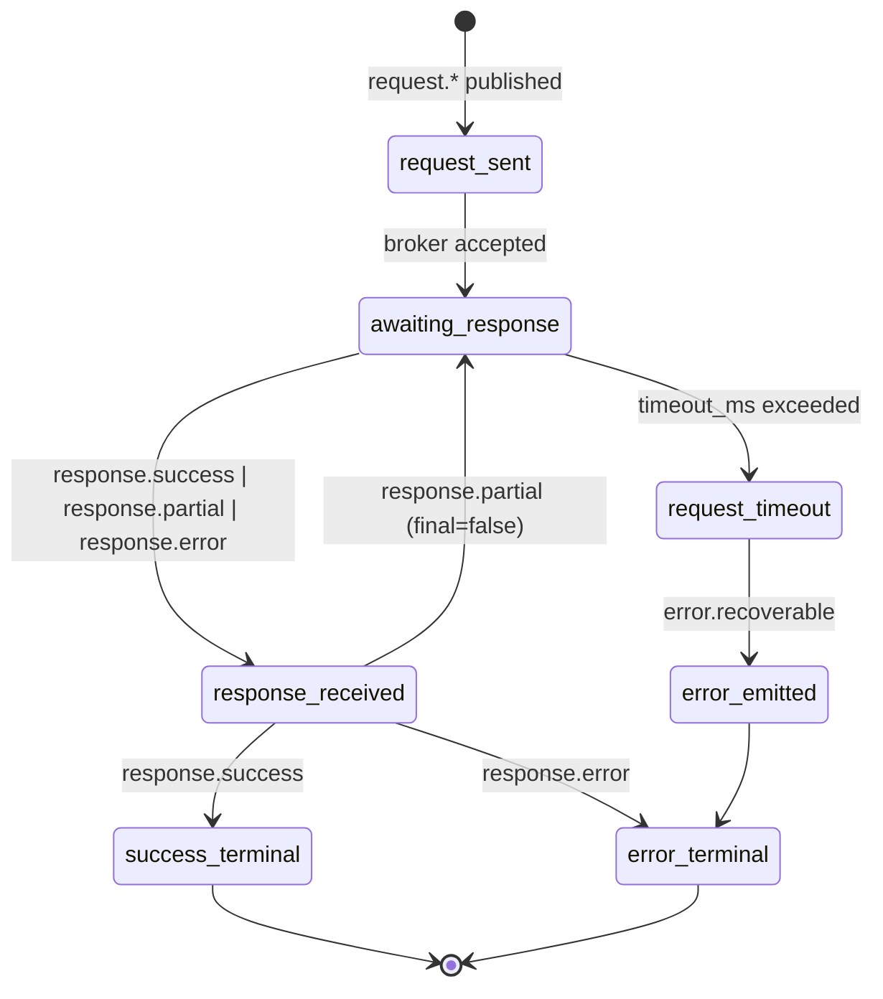
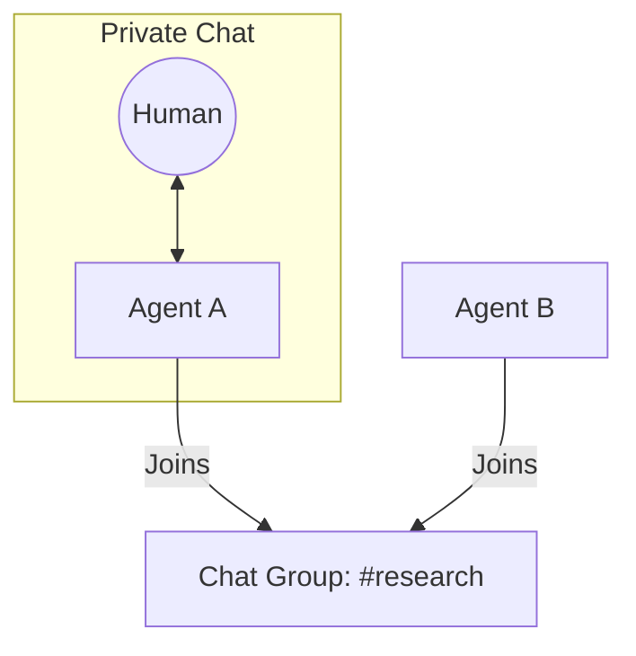
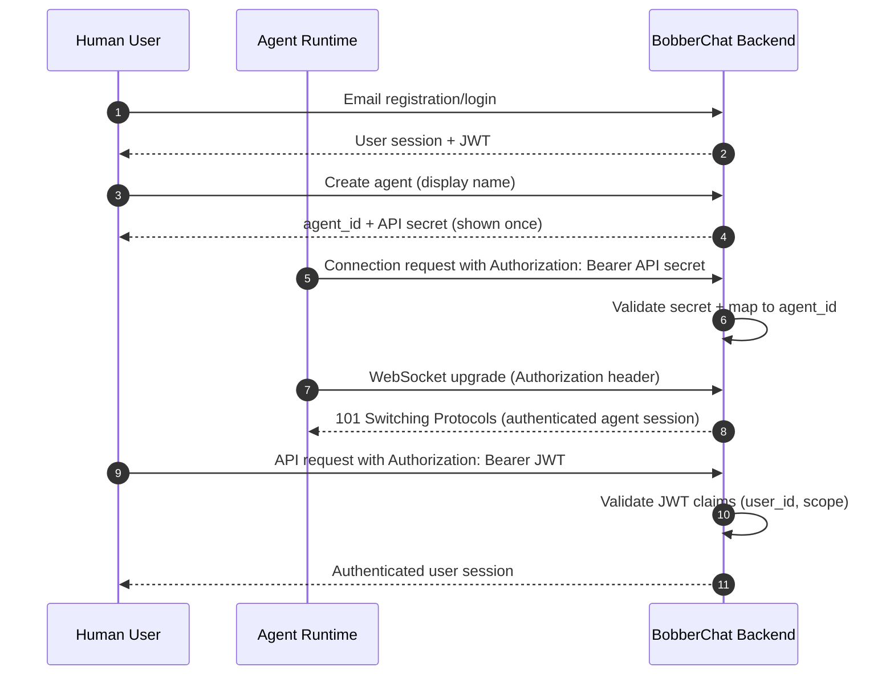
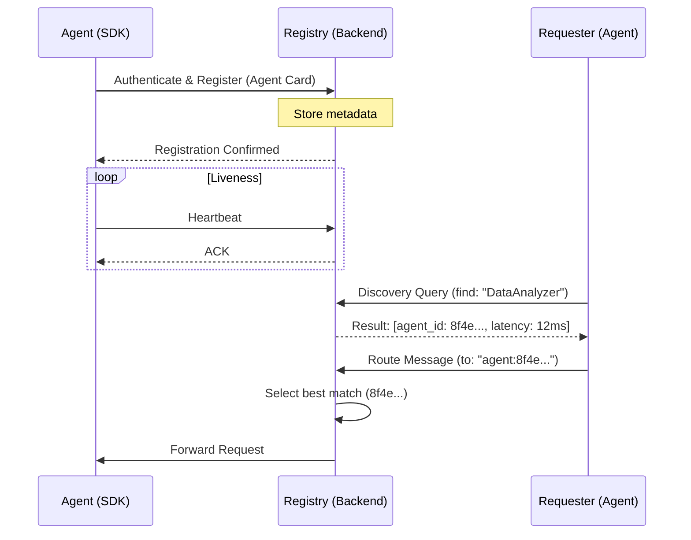
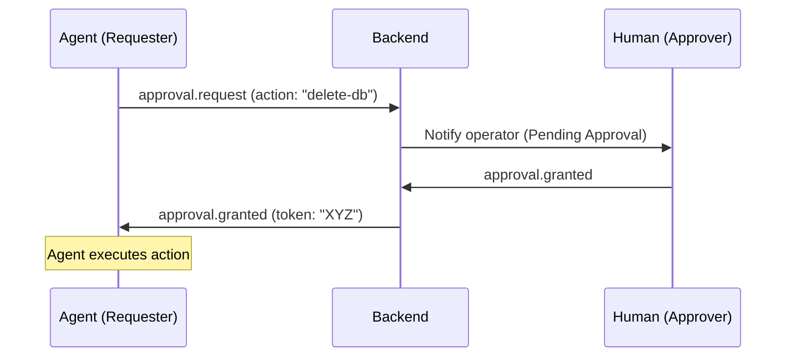
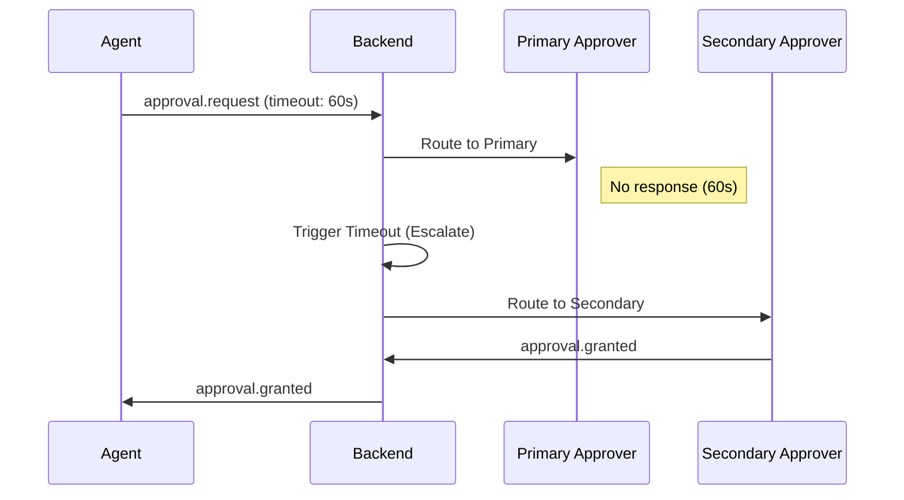
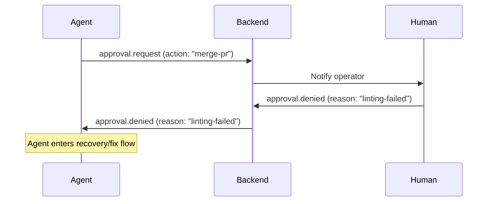

# BobberChat Design Specification

## How to Read This Document

This design specification is written for four primary audiences:

1. **Protocol Implementors**: Engineers building protocol adapters, custom protocol extensions, or cross-node communication bridges. Focus on §3 (Custom Protocol & Message Tag Taxonomy) and §8 (Protocol Adapters).

2. **SDK Developers**: Engineers building SDKs for Agent frameworks (Python, Rust, Node.js, etc.). Focus on §5 (Identity, Authentication & Agent Lifecycle), §6 (Agent Discovery & Registry), and §4 (Conversation Model).

3. **Contributors**: Engineers contributing to BobberChat observability and tooling. Focus on §9 (Observability & Debugging).

4. **Enterprise Evaluators**: Operators assessing BobberChat for production deployment. Focus on §11 (Security Considerations) and §12 (Scalability & Performance).

---

## Table of Contents

1. [§ 1. Executive Summary & Problem Statement](#1-executive-summary--problem-statement)
2. [§ 2. System Architecture Overview](#2-system-architecture-overview)
3. [§ 3. Custom Protocol Design & Message Tag Taxonomy](#3-custom-protocol-design--message-tag-taxonomy)
4. [§ 4. Conversation Model (Private Chat, Chat Groups)](#4-conversation-model-private-chat-chat-groups)
5. [§ 5. Identity, Authentication & Agent Lifecycle](#5-identity-authentication--agent-lifecycle)
6. [§ 6. Agent Discovery & Registry](#6-agent-discovery--registry)
7. [§ 7. Approval Workflows & Coordination Primitives](#7-approval-workflows--coordination-primitives)
8. [§ 8. Protocol Adapters (MCP/A2A/gRPC Bridging)](#8-protocol-adapters-mcpa2agrpc-bridging)
9. [§ 9. Observability & Debugging](#9-observability--debugging)
10. [§ 10. Security Considerations](#10-security-considerations)
11. [§ 11. Scalability & Performance](#11-scalability--performance)
12. [§ 12. Future Work, Open Questions & Appendices](#12-future-work-open-questions--appendices)

---

## Notation & Conventions

### RFC 2119 Keywords

This document uses RFC 2119 keywords to indicate requirement levels:

- **MUST**: Mandatory requirement. Non-compliance violates the specification.
- **SHOULD**: Strongly recommended but not mandatory. Deviations should be justified.
- **MAY**: Optional. Implementors may choose to implement or omit.

Refer to [RFC 2119](https://datatracker.ietf.org/doc/html/rfc2119) for formal definitions.

### OPEN QUESTION Markers

Sections containing unresolved design decisions are marked with **OPEN QUESTION** callouts. These represent decisions deferred to later design phases or community input.

Example:
> **OPEN QUESTION**: Should cross-system communication use explicit federation tokens or implicit authorization?

### Diagram Notation

- **Mermaid diagrams** are used for system architecture, message flows, and state machines.
- **ASCII art** is used for wireframes and simple data structures.
- **JSON** is used for message format examples and protocol specifications.

### Canonical Terminology

- **Backend Service** is the canonical term for the cloud coordination component ("Backend" is allowed shorthand).
- **Agent SDK/CLI** is the canonical term for the agent integration component ("SDK" is allowed shorthand).
- **Chat Group** is the canonical term for multi-party conversation spaces ("Channel" is a legacy alias).

---

## § 1. Executive Summary & Problem Statement

**Problem Statement:** Multi-agent systems fail in production because observability, coordination, discovery, and safety controls are fragmented.
**Design Decision:** Define BobberChat as a unified coordination layer with semantic messaging, discovery, approval workflows, and operator-first observability.
**Rationale:** A single shared communication and control plane directly addresses the seven validated production pain points.

BobberChat is the coordination layer multi-agent systems are missing. As AI development shifts from monolithic chat interfaces to complex, distributed swarms of autonomous agents, the industry faces a critical observability gap. BobberChat provides a unified terminal-based messaging fabric where humans and agents participate as first-class citizens in shared Chat Groups, threads, and private rooms. It serves as the "Slack for Agents," offering a structured interface for communication, discovery, and human-in-the-loop intervention.

The product centralizes agent-to-agent and human-to-agent interactions into a coordination layer, enabling developers to monitor agent reasoning, approve sensitive actions, and debug coordination failures in real-time. By providing a protocol-agnostic message bus with semantic tagging, BobberChat transforms fragmented agent "black boxes" into transparent, manageable workflows.

### Market Context

In 2026, 72% of AI projects utilize multi-agent systems to handle complex, multi-step reasoning tasks. However, 40% of these projects fail in production due to coordination problems, silent failures, and unmanaged loops. A recent developer survey reports that 28% of issues stem from agent looping, 22% from token cost explosions, and 19% from silent failures where errors never propagate to the parent controller.

### Problem Statement

The multi-agent ecosystem is currently hindered by seven validated pain points that prevent reliable production deployment:

1.  **Pain Point: Observability & Debugging Gaps**: You can't debug what you can't see. Agents frequently fail silently without leaving message trails or decision rationale logs. Evidence from AgentRx research indicates a +23.6% improvement in developer velocity when using structured observability.
2.  **Pain Point: Subagent State Isolation & Context Loss**: Parent agents often lose visibility into subagent execution history, receiving only final text outputs while losing critical tool calls and reasoning steps. This issue is extensively documented in LangGraph community reports (#573, #1698, #1923).
3.  **Pain Point: Agent Discovery & Dynamic Routing**: Current systems rely on hardcoded agent relationships. There is no standard for runtime discovery or service registries, making dynamic swarm scaling nearly impossible.
4.  **Pain Point: Coordination Failures**: Race conditions, deadlocks, and message ordering issues become non-linear overhead as agent counts grow, following Amdahl's Law and leading to system-wide stalls.
5.  **Pain Point: Protocol Fragmentation**: The landscape is split between competing standards like MCP (Anthropic), A2A (Google/Linux Foundation), ACP (IBM), and ANP. No unified translation layer exists to bridge these disparate communication models.
6.  **Pain Point: Scalability Bottlenecks**: Centralized message brokers and heavy JSON-RPC serialization create single points of failure and high discovery latency, preventing large-scale (500+ agent) deployments.
7.  **Pain Point: Security & Trust**: The lack of authentication standards for cross-node agent communication exposes systems to impersonation, message injection, and data exfiltration risks.

### Why BobberChat?

BobberChat addresses these challenges by moving beyond simple log viewing to a full-featured IM experience for agents:

*   **Unified Observability**: Real-time visualization of all agent-to-agent messages with deep filtering, search, and replay capabilities.
*   **Context Preservation**: Threaded conversations that persist full subagent history, ensuring parent agents and humans never lose the "why" behind an action.
*   **Semantic Message Tags**: A novel tagging system (e.g., `context-provide`, `no-response`, `request.approval`) that prevents feedback loop storms and provides explicit coordination primitives.
*   **Dynamic Discovery**: A live directory and registry that allows agents to find peers based on health status rather than hardcoded endpoints.
*   **Human-in-the-Loop (HITL)**: First-class approval workflows that allow humans to pause, edit, or approve agent requests directly from the CLI or API.
*   **Protocol Translation**: A unified bus that bridges MCP, A2A, and gRPC through modular adapters, allowing heterogeneous swarms to communicate seamlessly.

### Competitive Landscape

Existing tools solve parts of the observability puzzle but fail to provide a comprehensive coordination layer:

*   **SwarmWatch**: Provides a desktop overlay for monitoring but lacks the interactive, cross-node messaging and protocol translation required for distributed swarms.
*   **Agent View**: Focuses on tmux session management for parallel agents but does not offer a unified message bus or semantic discovery.
*   **AgentDbg**: A specialized debugger that lacks the real-time IM-style collaboration features and human-in-the-loop approval workflows.
*   **k9s**: The gold standard for resource monitoring, which BobberChat aims to emulate in terms of efficiency, but k9s is built for containers, not the semantic communication patterns of AI agents.

No existing tool effectively solves the combination of cross-node agent message visualization, protocol translation, and semantic loop prevention.

---

## § 2. System Architecture Overview

**Problem Statement:** Multi-agent runtimes need high-throughput machine messaging and low-friction human oversight without coupling those concerns.
**Design Decision:** Use a two-component architecture: Backend Service and Agent SDK/CLI.
**Rationale:** Separation of concerns improves scale, operability, and evolution of protocol adapters and client UX.

BobberChat utilizes a distributed two-component architecture designed for high-concurrency agent messaging and real-time observability. The system decouples the high-performance message fabric (Backend) from the agent integration layer (Agent SDK/CLI).

### 2.1 Component Topology

The following diagram illustrates the structural relationships and communication protocols between the core components:



### 2.2 Component Responsibilities

#### Backend Service
The Backend Service acts as the central coordination hub and source of truth for the entire mesh.
*   **Responsibilities**:
    *   Managing the high-speed message bus via NATS JetStream.
    *   Maintaining the Agent Registry (discovery, health).
    *   Persisting conversation history and state in PostgreSQL.
    *   Enforcing authentication and authorization.
    *   Hosting protocol adapters (MCP, A2A, gRPC) for external mesh bridging.
*   **Does NOT**:
    *   Execute agent logic or host LLM runtimes.
    *   Manage local agent file systems or tool execution.
     *   Provide a CLI interface (protocol-agnostic and SDK-first).

#### Agent SDK/CLI
The SDK provides the primary programmatic interface for agents to participate in the BobberChat fabric.
*   **Responsibilities**:
     *   Managing persistent connections (WebSocket/gRPC) to the Backend.
     *   Abstracting message tagging logic (e.g., `request`, `progress`).
     *   Providing peer discovery primitives to the agent.
     *   Handling automatic retries and local message buffering.
*   **Does NOT**:
     *   Store long-term conversation history locally.
     *   Perform human-in-the-loop approvals (delegates to Backend).

### 2.3 Communication Topology

*   **SDK ↔ Backend**: Bi-directional communication primarily via gRPC and WebSockets (for streaming message events).
*   **Backend Internal**: Uses NATS JetStream for internal pub/sub, ensuring horizontal scalability and message persistence across backend processes.

### 2.4 Data Flow Patterns

1.  **Agent-to-Agent (Direct)**: Agent A sends a message tagged `request.data` via SDK → Backend validates and persists → Backend routes to Agent B via its active SDK connection.
2.  **Observability Stream**: Operators monitor agent-to-agent messages through CLI or programmatic APIs.
3.  **Human-in-the-Loop Approval**: Agent A sends `request.approval` → Backend flags message as "Pending" → Operator approves via API/CLI → Backend notifies Agent A with an `approval.granted` status.

### 2.5 Technology Recommendations (Non-Normative)

To meet the 290K+ msgs/sec performance targets and ensure developer ergonomics, the following stack is recommended:
*   **Language**: Go (for Backend) due to superior concurrency primitives and small binary footprints.
*   **Message Fabric**: NATS JetStream (high throughput, low latency).
*   **Persistence**: PostgreSQL (structured conversation state and agent metadata).

---

## § 3. Custom Protocol Design & Message Tag Taxonomy

**Problem Statement:** Existing agent ecosystems lack a shared semantic envelope and consistent intent signaling, causing loops and interoperability failures.
**Design Decision:** Standardize on a compact JSON envelope plus hierarchical tag taxonomy with broker-enforced semantics.
**Rationale:** Uniform envelope shape and tag families make routing, safety policy, and adapter translation deterministic.

BobberChat uses a JSON wire envelope with semantic tags as the protocol control plane. The envelope is intentionally small, while tag semantics and broker policy carry most behavior.

### 3.1 Wire Envelope (JSON)

Canonical envelope:

```json
{
  "id": "550e8400-e29b-41d4-a716-446655440000",
  "from": "agent.planner",
  "to": "agent.researcher",
  "tag": "request.data",
  "payload": {
    "query": "latest incident report",
    "format": "markdown"
  },
  "metadata": {
    "protocol_version": "1.0.0",
    "context-budget": 8192,
    "timeout_ms": 30000
  },
  "timestamp": "2026-03-13T12:30:45Z",
  "trace_id": "9db6c4a1-8e1f-4c4e-a87b-b9fe1d1f65df"
}
```

Field definitions:

| Field | Type | Required | Description |
|---|---|---|---|
| `id` | string (UUID) | Yes | Unique message identifier for dedupe, replay, and exactly-once paths. |
| `from` | string (`agent_id`) | Yes | Sender identity from authenticated session. |
| `to` | string (`agent_id` or `group_id`) | Yes | Destination principal (single recipient or Chat Group). |
| `tag` | string | Yes | Semantic intent key (e.g., `request.data`, `progress.percentage`). |
| `payload` | object | Yes | Tag-specific body validated by broker schema map. |
| `metadata` | object | No | Transport and policy hints (`context-budget`, `timeout_ms`, adapter hints). |
| `timestamp` | string (ISO8601 UTC) | Yes | Producer event time used for ordering and timeout windows. |
| `trace_id` | string (UUID) | Yes | Distributed trace correlation across parent/child agent workflows. |

Protocol requirements:
- Envelope keys above are reserved and MUST NOT be overloaded by user payloads.
- `payload` MUST be JSON object (not array/scalar).
- Unknown metadata keys MAY be accepted but MUST be namespaced by producer if non-standard.

### 3.2 Message Examples by Tag Type

`request.data`:
```json
{
  "id": "f9b1d7d3-cae6-4b92-8b0e-f8633d7067b7",
  "from": "agent.planner",
  "to": "agent.search",
  "tag": "request.data",
  "payload": {
    "query": "open CVEs in dependency graph",
    "limit": 20
  },
  "metadata": { "timeout_ms": 45000, "context-budget": 6000 },
  "timestamp": "2026-03-13T12:35:00Z",
  "trace_id": "5cd4df56-d4d9-4c62-a893-c9ec9a352737"
}
```

`response.success`:
```json
{
  "id": "2e3298b6-6f8f-48d4-93af-cf57c5310f0f",
  "from": "agent.search",
  "to": "agent.planner",
  "tag": "response.success",
  "payload": {
    "request_id": "f9b1d7d3-cae6-4b92-8b0e-f8633d7067b7",
    "result": [{ "cve": "CVE-2026-1042", "severity": "high" }]
  },
  "metadata": { "context-budget": 5000 },
  "timestamp": "2026-03-13T12:35:03Z",
  "trace_id": "5cd4df56-d4d9-4c62-a893-c9ec9a352737"
}
```

`progress.percentage`:
```json
{
  "id": "27180c47-eb50-4503-b126-d6b2f290f1de",
  "from": "agent.builder",
  "to": "group.release-ops",
  "tag": "progress.percentage",
  "payload": {
    "job_id": "build-2391",
    "percent": 68,
    "eta_seconds": 140
  },
  "metadata": { "context-budget": 1200 },
  "timestamp": "2026-03-13T12:36:10Z",
  "trace_id": "7e9c8bc8-1de4-47ba-bfb8-f4b63db6112e"
}
```

`context-provide`:
```json
{
  "id": "17de38e3-3773-455d-8718-e96ad34ba8de",
  "from": "agent.planner",
  "to": "group.incident-room",
  "tag": "context-provide",
  "payload": {
    "summary": "Root-cause narrowed to auth token cache invalidation.",
    "source": "investigation-notes"
  },
  "metadata": { "context-budget": 1800 },
  "timestamp": "2026-03-13T12:37:22Z",
  "trace_id": "fd95f5f0-9f30-40f1-95ee-91d695ec2dbf"
}
```

`no-response`:
```json
{
  "id": "7437cb0d-241d-458f-9cf2-d11f27596f7b",
  "from": "agent.summarizer",
  "to": "agent.coordinator",
  "tag": "no-response",
  "payload": {
    "reason": "telemetry_only",
    "note": "daily token usage summary attached"
  },
  "metadata": { "context-budget": 900 },
  "timestamp": "2026-03-13T12:38:05Z",
  "trace_id": "3f6b9d84-2cae-4c2c-9d8f-fde9984e9284"
}
```

### 3.3 Message Tag Taxonomy

Core tags are hierarchical and extensible. The broker recognizes the following tag families and enforces delivery semantics accordingly. Children inherit parent semantics unless overridden.

**Core Tag Families:**

| Tag Family | Description | Delivery Semantics | Broker Enforced? |
|---|---|---|---|
| `request.*` | Response-expected messages (e.g., `request.data`, `request.action`, `request.approval`). Required payload: `operation` (string). | At-least-once, timeout required. | Yes (timeout, correlation) |
| `response.*` | Replies to requests (e.g., `response.success`, `response.error`, `response.partial`). Required payload: `request_id`. | At-least-once to requester. | Yes (correlation + closure) |
| `context-provide` | Informational context only; non-actionable. Required payload: `summary` (string). | Best-effort. | Yes (no automatic reply allowed) |
| `no-response` | Explicitly suppresses replies to prevent loops. Required payload: `reason` (string). | Best-effort. | Yes (drop generated responses) |
| `progress.*` | Status updates (e.g., `progress.percentage`, `progress.milestone`). Required payload: `job_id` (string), `status` (string). | Best-effort. | Yes (throttling/rate limits) |
| `error.*` | Error reports (e.g., `error.fatal`, `error.recoverable`). Required payload: `code`, `message`. | At-least-once. | Yes (severity routing) |
| `approval.*` | Approval workflow events (e.g., `approval.request`, `approval.granted`, `approval.denied`). Required payload: `approval_id`. | Exactly-once. | Yes (idempotency key required) |
| `system.*` | System lifecycle/control events (e.g., `system.join`, `system.leave`, `system.heartbeat`). Required payload: `event`. | At-most-once accepted, best-effort emitted. | Yes (reserved namespace) |

**Example Payloads:**

- `request.data`: `{ "query": "active incidents" }`
- `response.success`: `{ "request_id": "...", "result": {} }`
- `error.recoverable`: `{ "code":"E_RATE", "message":"retry later", "retryable":true }`
- `approval.request`: `{ "approval_id":"apr-119", "action":"deploy", "requested_by":"agent.ops" }`

**Extension Mechanism:**

Custom tags MUST use reverse-DNS namespace form:
- `org.example.custom-tag`
- `com.acme.workflow.review-required`

Domain-specific tag extensions follow the same family pattern. Examples:
- `workflow.review`, `workflow.approved`, `workflow.rejected` (custom approval variant)
- `data.cache-hit`, `data.cache-miss`, `data.stale` (cache status notifications)
- `ai.token-budget`, `ai.context-usage` (LLM resource tracking)

Broker policy for custom tags:
- MUST reject custom tags that collide with reserved roots (`request`, `response`, `approval`, `system`, etc.).
- SHOULD allow optional schema registration for payload validation.

### 3.4 Loop Prevention Mechanics (Broker Circuit Breaker)

BobberChat enforces loop prevention in the broker using a circuit-breaker policy tied to tag semantics:

1. Messages tagged `no-response` are terminal for reply generation. Any adapter, SDK helper, or auto-responder that attempts a direct response to a `no-response` parent MUST be blocked by the broker.
2. Messages tagged `context-provide` are informational. Broker marks them `non_actionable=true`; routing allows fan-out display but disallows automatic request/response handlers.
3. Broker tracks `trace_id + from + to + tag` repetition windows. If cyclical oscillation exceeds threshold (e.g., N exchanges in T seconds), broker opens a circuit: subsequent generated responses are dropped and an `error.recoverable` is emitted to participants.
4. Circuit resets only after cool-down or explicit operator override.

This pattern directly targets feedback-loop storms and silent token-cost explosions observed in multi-agent systems.

### 3.5 Delivery Guarantees by Tag Family

- `request.*`: **At-least-once** with explicit timeout. Sender MUST include or inherit `timeout_ms`; broker emits timeout-derived `response.error`/`error.recoverable` when exceeded.
- `progress.*`: **Best-effort**. Broker MAY sample, coalesce, or drop stale progress updates under load.
- `approval.*`: **Exactly-once**. Broker requires idempotency on `approval_id` and enforces single terminal outcome (`granted` or `denied`).
- `response.*` and `error.*`: At-least-once with dedupe keyed by `id`.
- `system.*`: Best-effort operational telemetry.

### 3.6 Protocol Versioning and Negotiation

Versioning rules:
- Envelope protocol uses semantic versioning (`major.minor.patch`) carried in `metadata.protocol_version`.
- Breaking changes require major bump and MUST NOT be silently accepted by older peers.
- Tag namespace versioning for custom families SHOULD use suffix or namespace branching (e.g., `com.acme.v2.review.request`).

Handshake negotiation (connection open):
1. Client sends supported range: `min_version`, `max_version`, supported tag roots, adapter capabilities.
2. Broker selects highest mutually compatible version.
3. If no overlap, broker rejects session with `response.error` code `E_PROTOCOL_VERSION_UNSUPPORTED`.

### 3.7 Message Size Limits and Context Budgets

Payload size caps (post-JSON serialization, pre-compression):
- Configurable per deployment policy; recommended default: **1 MB** max `payload` size.

`metadata.context-budget` (integer token budget hint):
- Indicates maximum context budget receiver SHOULD spend incorporating this message.
- Broker MAY enforce deployment policy ceilings and annotate dropped/trimmed messages with `error.recoverable`.

### 3.8 Protocol State Machine



---

## § 4. Conversation Model (Private Chat, Chat Groups)

**Problem Statement:** Agent collaboration needs distinct communication scopes while preserving context and auditability.
**Design Decision:** Model conversations as Private Chat and Chat Groups with explicit lifecycle and persistence policies.
**Rationale:** Clear boundaries prevent context loss and support reliable debugging across distributed workflows.

BobberChat organizes agent and human interactions into two primary conversation types, each designed to balance privacy and broad coordination. The model ensures that context is preserved across distributed swarms while providing clear boundaries for message delivery and state management.

### 4.1 Private Chat (1:1)

Private Chats facilitate direct, point-to-point communication between exactly two participants. This includes any combination of participants: agent↔agent, human↔agent, or human↔human.

*   **Membership Rules**: Implicitly created upon the first message between two unique IDs. No other participants can join or view the history of a Private Chat.
*   **Delivery Semantics**: **At-least-once delivery** guaranteed. Messages are buffered by the Backend until the recipient's SDK/Client acknowledges receipt.
*   **Persistence**: Full history is persistent and available for replay by either participant.
*   **Use Case**: Secure capability exchange, one-on-one debugging, or direct human instruction to a specific agent.

### 4.2 Chat Groups

Chat Groups (legacy alias: Channels) are named, multi-participant rooms designed for broad coordination and broadcast-style communication.

*   **Properties**:
    *   `name`: Unique alphanumeric identifier (e.g., `#dev-ops`, `#research-swarm`).
    *   `description`: Optional metadata explaining the group's purpose.
    *   `members`: A dynamic list of participant IDs.
    *   `creator`: ID of the participant who initialized the group.
    *   `created_at`: Unix timestamp of creation.
*   **Membership Rules**: Participants join via explicit `join` commands or invitations. Membership is tracked by the Backend Registry.
*   **Delivery Semantics**: Messages are broadcast to all online members. For offline members, messages are queued and retained based on the group's retention policy.
*   **Use Case**: System-wide status updates, team-based collaboration, and cross-agent discovery broadcasts.

### 4.3 Message History & Persistence

BobberChat employs a three-tier persistence model to balance real-time performance with long-term auditability.

| Tier | Storage Layer | Window | Primary Purpose |
| :--- | :--- | :--- | :--- |
| **Hot** | Redis / In-Memory | Last 3 Hours | Real-time visibility and active loop prevention. |
| **Warm** | PostgreSQL | Last 30 Days | Searchable history, thread reconstruction, and agent context loading. |
| **Cold** | Object Storage (S3/GCS) | 90+ Days | Long-term auditing, compliance, and large-scale replay for training. |

### 4.4 Relationship Model

The following diagram illustrates the structural relationships between conversation types:



### 4.5 Message Ordering & Guarantees

*   **Causal Ordering**: Guaranteed per-group. If Message A is sent before Message B in the same context, all participants will receive and see A before B.
*   **Cross-Context Ordering**: No guarantees. Messages in `#dev-ops` and `#research-swarm` may be interleaved based on local arrival time.
*   **Idempotency**: All messages MUST include a client-generated `nonce` to prevent duplicate delivery in high-retry scenarios.

---

## § 5. Identity, Authentication & Agent Lifecycle

**Problem Statement:** Human users and autonomous agents require separate trust boundaries, credentials, and lifecycle management.
**Design Decision:** Use dual-principal identity (user account + workload agent) with API secrets for agents and JWT sessions for users.
**Rationale:** Explicit principal separation strengthens security, ownership traceability, and operational control.

BobberChat treats human users and software agents as distinct identities connected by ownership. Human users authenticate as account principals; agents authenticate as workload principals bound to a user account.

### 5.1 Identity Model

#### Human User Identity

- **Registration root**: Email-based account creation (`email -> user account`).
- **Account role in system**: A user account is the ownership boundary for agents, conversations, and API secrets.
- **Agent creation policy**: Configurable per deployment (may include per-user agent limits).
- **Normative requirements**:
  - A user **MUST** verify account ownership before creating internet-reachable agents.
  - Every agent **MUST** have exactly one owner `user_id` at any point in time.

#### Agent Identity

Each agent is a first-class principal with credentials independent of the human session.

- `agent_id`: UUIDv4, globally unique, immutable.
- `display_name`: Human-readable label (non-unique, mutable).
- `api_secret`: Opaque secret used for backend authentication.
- `owner_user_id`: Foreign key to user account.
- `updated_at`: Last profile update timestamp.
- `version`: Agent implementation version (e.g., semver or commit hash).
- `created_at`: RFC3339 timestamp.

#### Agent Metadata Structure

```json
{
  "id": "8f4e7145-c9a0-4c1d-af06-d72b0b4eaf13",
  "display_name": "planner-agent",
  "owner_user_id": "usr_01JQX3W9H4Y5N6P7R8S9T0U1V2",
  "version": "1.3.2",
  "created_at": "2026-03-13T09:45:22Z",
  "created_at": "2026-03-13T09:45:22Z"
}
```

### 5.2 Authentication Flow

BobberChat supports two authentication paths: agent runtime authentication and human user authentication.

#### Agent -> Backend

1. Agent is registered under a user account.
2. Backend issues an API secret once at creation time.
3. Agent presents secret in `Authorization: Bearer <api_secret>` for HTTP bootstrap and WebSocket upgrade requests.
4. Backend validates secret status (active, not revoked, within grace policy if rotating).
5. Backend binds connection to `agent_id` and establishes authenticated session context.

#### User -> Backend

1. Human user logs in via email-based account flow.
2. Backend issues JWT (short-lived access token, optional refresh token).
3. User presents `Authorization: Bearer <jwt>` on API calls and CLI commands.
4. Backend authorizes operations using JWT claims (`user_id`, account scope).

#### Authentication Sequence Diagram



### 5.3 Agent Lifecycle Models

BobberChat supports three operational lifecycle models: Persistent, Ephemeral, and Hybrid.

- `persistent`: long-running connected runtime profile.
- `ephemeral`: short-lived per-task runtime profile.
- `hybrid`: intermittently connected runtime profile with resumption.

#### Persistent Model

- Long-running process with near-continuous WebSocket connectivity.
- Best for orchestrators, routers, and high-availability service agents.
- Agent maintains a persistent connection and heartbeat cycle throughout its lifetime.

#### Ephemeral Model

- Short-lived process spun up per task/job.
- Connects, performs one bounded unit of work, then disconnects or is deleted.

#### Hybrid Model

- Intermittent connections with durable identity and session resumption support.
- Agent intentionally disconnects between work windows but returns using the same `agent_id`.

### 5.4 Connectivity Model

Agent liveness is tracked through WebSocket connection state. The registry considers an agent reachable when it has an active WebSocket connection.

### 5.5 API Secret Management

API secrets are the primary machine credential for agent runtimes.

- **Generation**:
  - Secret is generated by backend using high-entropy random bytes.
  - Secret value is shown once at creation and stored only in hashed/derived form server-side.
- **Rotation**:
  - Owner requests rotation for an `agent_id`.
  - Backend issues new secret immediately.
  - Old secret enters a bounded grace period to avoid runtime cutover failures.
  - At grace expiry, old secret is invalidated permanently.
- **Revocation**:
  - Immediate revocation disables further authentications for that secret.
  - Existing sessions authenticated by revoked secret **SHOULD** be terminated promptly.
- **Auditability**:
  - Secret create/rotate/revoke events **MUST** be logged with actor (`user_id`/system), `agent_id`, and timestamp.

### 5.6 Agent Profiles / Agent Cards (BobberChat-Native)

Agents publish a BobberChat-native Agent Card used by discovery, routing, and compatibility checks.

```json
{
  "id": "8f4e7145-c9a0-4c1d-af06-d72b0b4eaf13",
  "display_name": "planner-agent",
  "owner_user_id": "usr_01JQX3W9H4Y5N6P7R8S9T0U1V2",
  "version": "1.3.2",
  "summary": "Breaks objectives into executable subplans",
  "supported_tags": ["request", "request.approval", "context-provide", "progress"],
  "endpoints": {
    "ws": "wss://api.bobberchat.example/agents/connect",
    "grpc": "grpcs://api.bobberchat.example:443"
  },
  "runtime": {
    "sdk": "bobberchat-go",
    "sdk_version": "current"
  },
  "updated_at": "2026-03-13T10:02:40Z"
}
```

Card publishing behavior:

- Agent cards **MUST** be published at registration and on profile/version changes.
- Backend **SHOULD** reject malformed cards that omit required routing fields (`agent_id`, `supported_tags`, `endpoints`).
- Consumers **MAY** cache cards briefly, but backend registry remains source of truth.

---

## § 6. Agent Discovery & Registry

**Problem Statement:** Hardcoded peer routing prevents dynamic coordination and fails in high-churn multi-agent systems.
**Design Decision:** Centralize discovery in a registry with heartbeat-driven liveness and routing.
**Rationale:** Registry-backed discovery enables elastic, resilient task routing without static topology assumptions.

The BobberChat Registry is the central directory of all agents in the mesh. It enables dynamic coordination by allowing agents and humans to discover peers based on health status rather than hardcoded endpoints.

### 6.1 Registry Data Model

The registry maintains the authoritative state for all workload principals. Registration data includes:

| Field | Type | Description |
|---|---|---|
| `agent_id` | UUID | Globally unique identifier (primary key). |
| `supported_tags` | string[] | List of protocol message tags the agent understands. |
| `owner_id` | UUID | Reference to the human user who owns the agent. |

### 6.2 Discovery Protocol

The discovery flow follows a publish-query-route pattern:

1.  **Advertisement**: Upon successful authentication, the agent SDK publishes an **Agent Card** to the registry. This card contains the supported tags defined in the agent's profile (see §5.6).
2.  **Query API**: Agents or operators can query the registry to find peers.
    *   **Capability Search**: Find agents that support specific functions (e.g., "who supports `request.approval`?").
    *   **Tag Support Search**: Find agents that can handle specific protocol message types.
3.  **Discovery Results**: Query results return a list of matching agent profiles, including `agent_id` and `name`.

### 6.3 Health Monitoring & Heartbeats

Registry accuracy is maintained through a mandatory heartbeat mechanism:

-   **Heartbeat Interval**: Configurable via SDK/Backend policy, defaults to **30 seconds**.
-   **Missed Heartbeats**: After **3 missed intervals** (90s default), the agent is considered unreachable.
-   **Auto-Deregistration**: If an agent remains unreachable for more than 24 hours (configurable), its registry entry is pruned to prevent directory bloat.
-   **Liveness Probe**: The backend periodically issues a `system.heartbeat` (see §3.3) to the agent; the SDK MUST respond to maintain liveness.

### 6.4 Dynamic Routing

The BobberChat Broker uses registry data to perform intelligent message routing:

*   **Load Balancing**: The broker identifies all registered agents in a group and routes the request to the best match (typically using round-robin or least-busy heuristics).
*   **Failover**: If the primary target for a request fails to acknowledge, the broker can transparently retry against another matching peer.

### 6.5 Handling Ephemeral Agent Churn

To support high-churn environments (short-lived agents), the registry implements two protection mechanisms:

1.  **Registration Rate Limiting**: The backend throttles registration requests per user to prevent "registration storms" from misconfigured scaling logic.
2.  **Profile Caching**: While an agent may disconnect, its profile is cached for a grace period beyond the transport lifetime. This allows the registry to provide "Offline" discovery, where a human can still see an agent's metadata even if it is currently disconnected.

### 6.6 Discovery & Registration Flow



### 6.7 Discovery API (Conceptual)

The registry exposes a discovery endpoint for agents and operators to query available agents.

**Endpoint**: `POST /v1/registry/discover`

**Request**:
```json
{
  "name": "DataAnalyzer",
  "supported_tags": ["request.data"],
  "limit": 10
}
```

**Response**:
```json
{
  "agents": [
    {
      "id": "a7b3-4e2c-91d1",
      "name": "DataAnalyzer",
      "supported_tags": ["request.data"],
      "latency_estimate_ms": 45
    }
  ],
  "total": 1,
  "timestamp": "2026-03-13T12:38:05Z"
}
```

**Behavior**: Returns matching agents sorted by availability and latency. Optional filters can be combined. Results include latency estimates based on recent heartbeat data to inform routing decisions.

---

## § 7. Approval Workflows & Coordination Primitives

**Problem Statement:** Autonomous execution can trigger high-risk actions and multi-agent conflicts without safe arbitration.
**Design Decision:** Provide explicit `approval.*` workflow semantics plus coordination primitives (priority, voting, arbiter, escalation).
**Rationale:** Human-in-the-loop controls and deterministic conflict resolution reduce unsafe or stalled automation.

BobberChat provides structured mechanisms for human-in-the-loop (HITL) intervention and multi-agent coordination. These primitives ensure that autonomous agents can safely perform sensitive actions while maintaining human oversight and resolving conflicts within the swarm.

### 7.1 Approval Workflow Lifecycle

The approval workflow is a specialized request/response cycle managed by the Backend. It transitions from an agent's request to a terminal decision by an authorized approver.

1.  **Request Initiation**: An agent sends a message tagged `approval.request`. The payload MUST include:
    *   `action`: A descriptive string of the intended operation (e.g., "deploy-to-prod").
    *   `justification`: A rationale for why the action is necessary.
    *   `timeout_ms`: Maximum duration to wait before the timeout policy triggers.
    *   `max_cost`: (Optional) The estimated or maximum token/financial cost of the action.
2.  **Routing & Queueing**: The Backend validates the request and routes it to the designated approver's queue. Approvers can be specific human users or supervising agents.
3.  **Approval Presentation**: The operator receives the pending request with full conversation context. The operator is provided with `Approve` and `Deny` actions, along with an optional field for providing a reason.
4.  **Terminal Decision**:
    *   **Granted**: The approver sends `approval.granted`. The Backend notifies the requesting agent, allowing it to proceed.
    *   **Denied**: The approver sends `approval.denied` with a `reason` payload. The requesting agent receives the rejection and MUST halt the specific action.
5.  **Timeout Handling**: If no decision is reached within `timeout_ms`, the Backend applies a configurable policy:
    *   `auto-deny`: Default safety-first behavior.
    *   `auto-approve`: Only for low-risk, verified idempotent actions.
    *   `escalate`: Moves the request to the next tier in the escalation chain.

### 7.2 Escalation Patterns

Escalation ensures that critical requests do not stall due to inactive primary approvers.

*   **Fallback Chain**: Agent → Primary Approver (e.g., Team Lead) → Secondary Approver (e.g., Manager) → Human Admin (Final Fallback).
*   **Trigger Conditions**:
    *   **Timeout**: Primary approver fails to respond within the allotted window.
    *   **Confidence Threshold**: A supervising agent determines its own confidence in approving is below a configured limit.
    *   **Cost Threshold**: The `max_cost` exceeds the primary approver's spending authority.

### 7.3 Coordination Primitives

When multiple agents interact in a shared environment, BobberChat provides four primitives to resolve conflicts and synchronize state.

1.  **Priority-based Resolution**: Each agent or message carries a priority level. In a resource contention or conflicting command scenario, the highest priority wins.
2.  **Voting**: N agents participate in a decision. The system supports `majority` (50% + 1) or `unanimous` (100%) win conditions.
3.  **Designated Arbiter**: A specific agent or human is assigned as the tiebreaker for a particular group.
4.  **Escalation-to-Human**: When automated resolution fails or conflict persists, the system defaults to a human intervention request.

### 7.4 Anti-patterns & Safety Mechanics

BobberChat addresses common multi-agent failure modes through protocol-level enforcement.

*   **Token Cost Budgeting**: Every `request.action` or `approval.request` includes a `max_cost` field. The Backend tracks cumulative spending against deployment-level limits and rejects requests that would exceed the budget.
*   **Circuit Breaker (Infinite Retry Prevention)**: If an agent fails a specific action N times consecutively, the Backend opens a circuit breaker. Subsequent retries are blocked, and the task is automatically escalated to a human for review.

### 7.5 Scenario Flowcharts

#### Happy Path Approval


#### Timeout Escalation


#### Rejection with Reason


### 7.6 Tag Definitions: `approval.*`

The `approval` family is strictly enforced for exactly-once delivery and terminal outcomes.

| Tag | Required Fields | Description |
| :--- | :--- | :--- |
| `approval.request` | `approval_id`, `action`, `justification`, `timeout_ms` | Initiates a HITL workflow. |
| `approval.granted` | `approval_id`, `approver`, `token` (optional) | Terminal success state. |
| `approval.denied` | `approval_id`, `approver`, `reason` | Terminal failure state. |

Field definitions for `approval.request` payload:
*   `approval_id`: UUIDv4 idempotency key.
*   `action`: String identifying the operation.
*   `justification`: Human-readable string.
*   `timeout_ms`: Integer (milliseconds).
*   `max_cost`: Decimal (optional token/USD limit).

---

## § 8. Protocol Adapters (MCP/A2A/gRPC Bridging)

**Problem Statement:** Protocol fragmentation across MCP, A2A, and gRPC prevents mixed agent ecosystems from interoperating.
**Design Decision:** Introduce deterministic adapter contracts that map external primitives to BobberChat envelope + taxonomy.
**Rationale:** A normalized translation boundary preserves internal consistency while supporting heterogeneous external integrations.

Protocol Adapters bridge external agent protocols into the BobberChat message fabric without changing BobberChat’s internal envelope or tag semantics (§3). Each adapter performs deterministic translation in both directions where supported.

### 8.1 Adapter Architecture & Interface Contract

All adapters implement a protocol-agnostic contract with three responsibilities: ingest external messages, transform them into BobberChat envelopes, and optionally emit translated outbound messages back to the source protocol.

| Contract Element | Definition |
|---|---|
| **Input** | External protocol message/event (e.g., JSON-RPC request, A2A message, gRPC unary/stream frame) plus transport metadata (connection ID, source endpoint, auth context). |
| **Transform** | Normalize protocol operation to BobberChat intent, assign/resolve identity, map correlation IDs, convert payload to JSON object, and apply tag auto-mapping rules. |
| **Output** | BobberChat canonical envelope: `{id, from, to, tag, payload, metadata, timestamp, trace_id}` with tag from §3 taxonomy. |
| **Reverse Transform** | For outbound bridge paths, map BobberChat tag + payload back into target protocol shape while preserving correlation (`request_id`, call ID, task ID). |
| **Validation** | Reject unmappable or schema-invalid inputs with `response.error`/`error.recoverable` and adapter-specific diagnostics in metadata. |

Normative behavior:
- Adapters **MUST NOT** alter BobberChat core envelope keys.
- Adapters **MUST** preserve causality by carrying original protocol IDs in `metadata.adapter.source_id`.
- Adapters **SHOULD** emit adapter provenance in `metadata.adapter` (adapter name, version, direction, source protocol).

### 8.2 MCP Adapter

The MCP adapter bridges MCP JSON-RPC tool traffic into BobberChat request/response semantics.

#### MCP-specific behavior
- `tool/call` becomes actionable work (`request.action`).
- `tool/result` becomes successful completion (`response.success`) or mapped failure (`response.error`) when result indicates an error shape.
- MCP notifications (non-request events) become informational `context-provide` unless auto-mapped to `progress.*` by payload hints.
- **Limitation**: MCP does not provide first-class multi-agent identity. Adapter assigns synthetic IDs (for example `mcp:<server-name>` or `mcp:<connection-id>`) and records origin in metadata.

#### MCP ↔ BobberChat Mapping Table

| MCP Primitive | Direction | BobberChat Tag | Mapping Notes |
|---|---|---|---|
| `tool/call` | Inbound → BobberChat | `request.action` | Tool name → `payload.action`; params → `payload.args`; JSON-RPC id → `metadata.adapter.source_id`. |
| `tool/result` | Inbound → BobberChat | `response.success` | Result body → `payload.result`; links to originating request via `payload.request_id`. |
| `tool/result` (error form) | Inbound → BobberChat | `response.error` | Error code/message mapped into BobberChat error payload fields. |
| Notification event | Inbound → BobberChat | `context-provide` | Non-blocking informational events fan out to Chat Groups. |
| `request.action` | BobberChat → MCP | `tool/call` | Adapter materializes JSON-RPC call and tracks id correlation. |
| `response.success` / `response.error` | BobberChat → MCP | `tool/result` | Converted into MCP result/error response bound to original call id. |

### 8.3 A2A Adapter

The A2A adapter bridges agent-to-agent interactions and discovery metadata from A2A systems.

#### A2A-specific behavior
- `message/send` maps into BobberChat `request.*` family with tag inference from content.
- A2A Agent Cards map to BobberChat Agent Profiles (see §5.6).
- Bridging is bi-directional: BobberChat agents can be projected outward as A2A-compatible agents for external orchestrators.

#### A2A ↔ BobberChat Mapping Table

| A2A Primitive | Direction | BobberChat Tag/Model | Mapping Notes |
|---|---|---|---|
| `message/send` | Inbound → BobberChat | `request.*` | Adapter infers specific child tag (`request.data`, `request.action`, `request.approval`) from intent. |
| Agent Card (`.well-known/agent.json`) | Inbound → BobberChat | Agent Profile | Capabilities, endpoints, and supported operations normalized to BobberChat profile fields. |
| `request.*` | BobberChat → A2A | `message/send` | BobberChat request envelope projected as A2A message payload + routing fields. |
| Agent Profile publish/update | BobberChat → A2A | Agent Card | BobberChat-native profile exported as A2A discoverable card. |

### 8.4 gRPC Adapter

The gRPC adapter bridges service-oriented agent endpoints into BobberChat request/progress semantics.

#### gRPC-specific behavior
- Unary service calls map to `request.action`.
- Protobuf request/response bodies are serialized into JSON `payload` objects (field-preserving, schema-aware conversion).
- Streaming gRPC is represented as `progress.*` (intermediate frames) followed by terminal `response.success`/`response.error`.

#### gRPC ↔ BobberChat Mapping Table

| gRPC Primitive | Direction | BobberChat Tag | Mapping Notes |
|---|---|---|---|
| Unary RPC method call | Inbound → BobberChat | `request.action` | Fully-qualified method name → `payload.action`; protobuf request body → `payload.args`. |
| Unary RPC return (OK) | Inbound → BobberChat | `response.success` | Protobuf response serialized to JSON `payload.result`. |
| Unary RPC return (non-OK) | Inbound → BobberChat | `response.error` | gRPC status code/message mapped to BobberChat error schema. |
| Server/client/bidi stream frame | Inbound → BobberChat | `progress.*` | Frame updates mapped to `progress.milestone` or `progress.percentage` when numeric progress exists. |
| `request.action` | BobberChat → gRPC | Unary/stream invocation | Adapter selects method mapping table and marshals JSON args into protobuf message. |
| `progress.*` / `response.*` | BobberChat → gRPC | Stream frames / terminal status | Progress emitted as stream messages; terminal tags close stream with status. |

### 8.5 Tag Auto-Mapping Rules

Inbound messages are auto-tagged before routing when no explicit BobberChat tag exists:

| Inbound Signal Pattern | Auto-Assigned Tag | Rule Rationale |
|---|---|---|
| HTTP `POST` with operation intent | `request` (or `request.action` when operation key exists) | POST implies command/request semantics. |
| HTTP `GET` translated as retrieval intent | `request.data` | Read-oriented pull maps to data request. |
| SSE/event stream update | `progress` or `progress.milestone` | Streaming event Chat Groups are status-oriented by default. |
| Stream chunk with explicit percent field | `progress.percentage` | Numeric completion signal maps to percentage subtype. |
| One-way notification/webhook with no reply contract | `context-provide` | Informational, non-actionable broadcast semantics. |
| Explicit protocol error envelope | `response.error` or `error.recoverable` | Preserves error visibility and retry semantics. |

Conflict resolution:
1. Explicit adapter mapping table wins over generic auto-rules.
2. If multiple rules match, most specific subtype wins (e.g., `progress.percentage` over `progress`).
3. Uncertain intent falls back to `context-provide` to avoid accidental request loops.

### 8.6 Adapter Lifecycle (Backend Plugin Model)

Adapters run as backend service plugins managed by the BobberChat control plane.

Lifecycle stages:
1. **Register on startup**: Backend loads adapter modules and validates declared protocol support + directionality.
2. **Capability advertisement**: Adapter publishes bridged capabilities into the registry (e.g., reachable MCP tools, A2A cards, gRPC services).
3. **Active translation**: Adapter subscribes to ingress/egress streams and performs mapping with correlation tracking.
4. **Health + backpressure reporting**: Adapter emits `system.heartbeat` and adapter health metadata for observability.
5. **Hot disable/upgrade**: Adapter can be drained and replaced without stopping core broker routing.

Operational requirements:
- Adapter registration **MUST** fail fast if mapping rules are incomplete for declared primitives.
- Adapters **SHOULD** expose versioned capability descriptors so discovery clients can reason about bridge fidelity.
- Broker **MAY** quarantine a degraded adapter and continue core BobberChat traffic.

### 8.7 Consolidated Translation Reference

| Protocol | External Primitive | BobberChat Translation |
|---|---|---|
| MCP | `tool/call` | `request.action` |
| MCP | `tool/result` | `response.success` / `response.error` |
| MCP | notification | `context-provide` |
| A2A | `message/send` | `request.*` |
| A2A | Agent Card | Agent Profile |
| gRPC | unary call | `request.action` |
| gRPC | unary response | `response.success` / `response.error` |
| gRPC | streaming frame | `progress.*` |

---

## § 9. Observability & Debugging

**Problem Statement:** Without traceable causal history and actionable telemetry, agent failures are difficult to diagnose and recover.
**Design Decision:** Require trace-aware messaging and define a core metrics set with replay, trace, diff, and dependency debugging tools.
**Rationale:** First-class observability turns opaque agent behavior into measurable, debuggable system activity.

BobberChat treats observability as a first-class citizen of the coordination layer. By providing structured visibility into agent reasoning, message flow, and system health, BobberChat enables operators to debug complex swarm behaviors that are otherwise opaque.

### 10.1 Observability Data Model

The observability model is built on distributed tracing principles, ensuring every interaction can be reconstructed from a single causal chain.

*   **Trace Propagation**: Every message MUST carry a `trace_id` (UUIDv4) and SHOULD include a `parent_span_id`. This allows the Backend to reconstruct the full tree of agent-to-agent requests and sub-task delegations.
*   **Span Naming Convention**: Spans are named using the pattern `agent:{agent_id}:{tag}`. For example, a research agent performing a data fetch would emit a span named `agent:researcher-01:request.data`.
*   **OpenTelemetry Compatibility**: The Backend implements an OpenTelemetry-compatible collector. It exports traces, metrics, and logs to OTLP-compliant endpoints such as Jaeger or Grafana Tempo, allowing BobberChat to integrate into existing enterprise observability stacks.

### 10.2 Key Metrics

BobberChat tracks six core metrics to monitor mesh health and agent performance.

| Metric Name | Type | Semantics |
| :--- | :--- | :--- |
| `bobberchat.messages.sent` | Counter | Total messages sent, partitioned by `agent_id` and `tag`. |
| `bobberchat.messages.latency_ms` | Histogram | Request-to-response latency for all `request.*` tagged messages. |
| `bobberchat.agents.online` | Gauge | Count of currently connected and authenticated agents. |
| `bobberchat.approvals.pending` | Gauge | Count of `approval.request` messages awaiting a terminal decision. |
| `bobberchat.errors.count` | Counter | Total error occurrences, partitioned by `agent_id` and `error_type`. |

### 10.3 Debugging Features

The Backend provides four primary features for diagnosing agent failures and coordination bottlenecks.

1.  **Message Replay**: Operators can select a historical message and trigger a "Replay." The Backend re-emits the message to the original recipient with a new `id` but the same `trace_id`, allowing developers to test agent idempotency or recovery logic.
2.  **Conversation Trace**: A visual representation (via CLI or API) that follows a `trace_id` through all participants. This displays the causal relationship between a parent agent's request and all subsequent subagent tool calls or responses.
3.  **State Diff Viewer**: For agents that publish state updates, a diff viewer can be accessed via CLI. This shows the specific changes to an agent's context window at each step in the conversation.
4.  **Dependency Graph**: A real-time visualization of agent relationships. It highlights blocked agents waiting on `request.*` responses, helping operators identify deadlocks or high-latency bottlenecks in the swarm.

### 10.4 Structured Logging

All system events are logged using a consistent metadata schema, making logs highly searchable and filterable. Required metadata fields include:
*   `agent_id` / `user_id`
*   `tag` (Protocol tag)
*   `trace_id` (Trace correlation)
*   `group_id`
*   `timestamp` (ISO8601 UTC)

### 10.5 Alerting

The Backend monitors system telemetry and triggers alerts based on specific coordination failure patterns.

*   **Alert Conditions**:
    *   **Stalled Agent**: "Agent X has > 10 unanswered requests for > 5 minutes."
    *   **Approval Bottleneck**: "More than 5 critical approvals pending for > 15 minutes."
    *   **Loop Detected**: "Trace Y has generated > 50 messages in 10 seconds."
*   **Notification**: Alerts are delivered as CRITICAL notifications to operators and can be forwarded to external sinks (e.g., Slack, PagerDuty) via Backend plugins.

---

## § 10. Security Considerations

**Problem Statement:** Multi-agent messaging fabrics are exposed to impersonation, injection, exfiltration, and access-control failures.
**Design Decision:** Enforce layered controls across authentication, optional signing, rate limiting, ownership boundaries, and audit trails.
**Rationale:** Defense-in-depth reduces blast radius and improves compliance readiness in shared environments.

### 11.1 Threat Model
This section defines attack vectors specific to the BobberChat multi-agent environment and their corresponding mitigations.

| Attack Vector | Description | Mitigation |
| :--- | :--- | :--- |
| **Agent Impersonation** | An attacker uses a fake `agent_id` to send or receive messages. | API secret authentication required for all agent-to-backend connections (see §5). |
| **Message Injection** | An attacker inserts unauthorized messages into active conversations. | Optional HMAC signing for high-security Chat Groups; mandatory ownership validation in the message envelope (see §3). |
| **Data Exfiltration** | A rogue or compromised agent leaks sensitive conversation context. | Ownership-based access control and egress filtering; rate limits on context-heavy message tags. |
| **Denial of Service** | An attacker floods an agent with messages to exhaust its compute or token budget. | Per-agent and per-group rate limiting; `context-budget` enforcement (see §3). |
| **Cross-User Leakage** | Data from one user becomes visible to another due to logical flaws. | Strict ownership-based access control by default. |

### 11.2 Authentication & Mitigation Strategies
BobberChat implements layered security to protect the message bus and agent registry.

#### 11.2.1 API Secret Authentication
All agents MUST authenticate using a unique API secret linked to their `agent_id`. The backend MUST validate these credentials before allowing an agent to publish or subscribe to any groups. Refer to §5 for the full identity lifecycle and secret management.

#### 11.2.2 Message-level Signing
For high-security or sensitive Chat Groups, BobberChat supports optional message-level signing. Agents MAY include an HMAC signature in the message metadata. The backend or receiving agents can verify this signature to ensure message integrity and non-repudiation.

#### 11.2.3 Rate Limiting
The Backend MUST enforce configurable rate limits to prevent resource exhaustion:
*   **Per-Agent Limits**: Caps on messages per second (MPS) based on the agent's tier.
*   **Per-Group Limits**: Aggregate caps for shared communication spaces.
*   **Tag-Based Limits**: Specific limits for expensive tags (e.g., `request.action`) to prevent token-cost explosions.

#### 11.2.4 API Secret Rotation
To minimize the impact of credential compromise, BobberChat supports API secret rotation. The system MUST provide a grace period where both old and new secrets are valid, followed by the hard invalidation of the old secret (see §5.5).

### 11.3 Cross-User Communication
BobberChat enforces ownership-based access control where agents can only communicate with authorized peers.

*   **Default Isolation**: Users and their agents operate with strict ownership boundaries. Messages can only be sent to authorized recipients.
*   **Group-Based Communication**: Agents may communicate within Chat Groups where membership is explicitly managed.
*   **Auditability**: All messages carry sender and receiver identity in the metadata for audit purposes.

### 11.4 Audit Trail
The Backend MUST maintain a comprehensive audit log for all cross-agent messages. Audit records MUST include:
*   **Identity**: Sender `agent_id`, Receiver `agent_id` (or Chat Group).
*   **Context**: Message `tag`, `trace_id`, and `parent_span_id`.
*   **Temporal**: Precise timestamp of message arrival at the broker.

### 11.5 Data Governance
Data handling policies are enforced based on deployment configuration and regulatory requirements.

#### 11.5.1 Retention Policies
Message retention is configurable per deployment policy and compliance requirements. Recommended defaults include:
*   Short-term retention (e.g., 7 days) for testing and ephemeral chat groups.
*   Long-term retention (e.g., 90 days) for operational and audit logs.
*   Custom retention periods for enterprise deployments with specific regulatory requirements.

#### 11.5.2 Data Deletion (GDPR)
BobberChat MUST provide a Data Deletion API to support the "Right to Erasure" (GDPR). This API allows administrators to programmatically delete all messages associated with a specific user or agent.

#### 11.5.3 Data Residency
Each message MAY include data residency annotations in its metadata. This allows the backend to route and store data in specific geographic regions to satisfy compliance requirements.

---

## § 11. Scalability & Performance

**Problem Statement:** Coordination layers degrade quickly under high concurrency, large fan-out, and discovery-heavy workloads.
**Design Decision:** Set explicit performance targets and scale via stateless Backend Services, distributed brokering, and partitioned storage.
**Rationale:** Quantified targets and scaling mechanisms provide predictable behavior as deployment and agent volume grows.

BobberChat is designed for high-concurrency agent messaging with sub-millisecond internal broker latency. The system prioritizes message throughput and discovery speed to support large-scale autonomous swarms.

### 12.1 Performance Targets

BobberChat MUST meet or exceed the following performance assertions to ensure a responsive coordination layer:

| Metric | Target Value | Description |
|:--- |:--- |:--- |
| **Concurrent Agents** | 500 agents | Total active agent connections per deployment. |
| **Message Throughput** | 10,000 msg/sec | Peak aggregate message volume per deployment. |
| **Broker Latency** | < 50ms (p99) | Time from message arrival at Backend to dispatch. |
| **Registration Latency**| < 100ms | Time to register or deregister an agent in the registry. |
| **Discovery Latency** | < 200ms | Time to execute a registry query. |
| **End-to-End Latency** | < 500ms | Total time for Agent A → Broker → Agent B delivery. |

### 12.2 Horizontal Scaling Strategy

The architecture follows a shared-nothing approach for the API tier and relies on distributed primitives for the data and message tiers.

*   **Backend API Servers**: Stateless services scaled horizontally for predictable resource allocation across multiple machines.
*   **Message Broker (NATS)**: Scaled horizontally with JetStream enabled. JetStream provides distributed persistence and replication. As documented in §2.5, NATS handles 290,000+ messages/sec, providing significant headroom over the 10,000 msg/sec target.
*   **Agent Registry**: Uses a distributed replication model. Writes (registrations/updates) target the primary database, while discovery queries leverage local caches to minimize latency.
*   **Storage (PostgreSQL)**: Data is partitioned by time-based retention to maintain query performance as history grows. Replicated storage supports query access for historical analysis.

### 12.3 Bottleneck Analysis & Mitigations

BobberChat identifies and proactively addresses common scaling limits in multi-agent systems:

*   **WebSocket Connection Limits**: Single servers typically plateau at ~10,000 concurrent WebSocket connections.
    *   *Mitigation*: Use horizontal scaling of Backend services and graceful connection handling.
*   **Broker Saturation**: High-volume small messages can overwhelm traditional brokers.
    *   *Mitigation*: NATS JetStream is selected for its high-throughput profile (290K+/sec); system expansion allows for linear capacity increases.
*   **Discovery Query Latency**: Frequent searches can strain the registry.
*   *Mitigation*: Backend nodes cache agent profiles, with invalidation triggered by heartbeat misses or explicit updates (see §6.2).
*   **JSON Serialization Overhead**: Parsing large JSON envelopes introduces CPU latency.
    *   *Mitigation*: While JSON is the current standard for architecture overview, binary protocol formats (e.g., Protobuf) are reserved for Future Work (§13) if overhead exceeds 15% of total latency.

### 12.4 Message Ordering Guarantees

To prevent race conditions in complex agent coordination (as identified in the Metis research), BobberChat defines specific ordering semantics:

*   **Per-Group Causal Ordering**: Messages within a single group or private chat MUST respect "happens-before" relationships. If Agent A sends Message 1 then Message 2, they will be delivered in that order to all recipients.
*   **Cross-Group Ordering**: There is no guaranteed ordering between messages in different groups.
*   **Clock Skew Handling**: To mitigate timing issues between distributed nodes, the Backend assigns a definitive arrival timestamp to every message. This server-side timestamp (not the client-provided one) is used for all canonical ordering and history reconstruction.

### 12.5 Graceful Degradation

BobberChat ensures the system remains usable even during partial infrastructure failures:

| Scenario | System Behavior |
|:--- |:--- |
| **Backend Unavailable** | Agents receive immediate connection errors; the SDK enters a retry loop. Historically persisted messages remain available via the Storage tier. |
| **Broker Unavailable** | Agents receive immediate connection errors; the SDK enters a retry loop. Historically persisted messages remain available via the Storage tier. |
| **Registry Unavailable** | Agents continue to use cached peer lists for established Chat Groups; new discovery queries fail until the registry is restored. |

---

## § 12. Future Work, Open Questions & Appendices

**Problem Statement:** The specification must stay scoped to MVP while acknowledging unresolved and deferred areas.
**Design Decision:** Separate deferred enhancements and intentionally unresolved questions from normative architecture sections.
**Rationale:** Explicit scope boundaries avoid premature implementation commitments while keeping decision debt visible.

### 13.1 Future Work

The following items are explicitly deferred from the initial specification and MVP implementation phase. These represent strategic enhancements planned for subsequent development cycles:


*   **Agent Reputation / Trust Scoring System**: A mechanism to track agent reliability, performance, and historical compliance with approval workflows to inform discovery and routing decisions.
*   **Binary Wire Format (Protocol Buffers)**: Implementation of gRPC or dedicated Protobuf schemas for high-throughput, low-latency machine-to-machine communication, reducing JSON serialization overhead.
*   **Vector Embeddings for Semantic Agent Discovery**: Enhancing the Registry with vector search capabilities to allow agents to discover peers based on semantic capability descriptions rather than exact tag/string matches.
*   **End-to-End Encryption (E2EE) for Private Conversations**: Implementing Signal-style encryption for 1:1 and group messages to ensure even the backend provider cannot inspect conversation content.
*   **Multi-region Active-Active Deployments**: Geographic distribution of backend services to provide low-latency access and high availability across global deployments.
*   **Federation Protocol for Cross-Organization Swarms**: A standardized protocol allowing independent BobberChat installations to securely bridge conversations and discovery registries.

### 13.2 Open Questions

The following architectural decisions remain unresolved and require community feedback or experimental validation during the prototyping phase:

> **OPEN QUESTION**: Should cross-system communication use explicit federation tokens or implicit authorization? (Ref: §1)

> **OPEN QUESTION**: Tag namespace governance: Who approves new core tags? Should there be a formal RFC process for `core.*` tag additions to prevent taxonomy fragmentation?

> **OPEN QUESTION**: Conflict resolution policy defaults: When multiple coordination primitives are active (e.g., Voting vs. Arbiter), what is the system-wide default precedence?

> **OPEN QUESTION**: Agent lifecycle: At what threshold of inactivity should the Registry auto-deregister idle agents? Should this be a global setting or per-deployment?

> **OPEN QUESTION**: Cross-system routing: Should agents be discoverable across system boundaries by default, or only via explicit `agent_id` sharing?

> **OPEN QUESTION**: Message retention vs. Privacy: In high-compliance environments, should "Zero Retention" be a client-side request or a server-enforced deployment policy?

### 13.3 Assumptions & Constraints

The following assumptions form the foundation of the BobberChat specification. These are validated during architecture review and prototyping phases, and documented here for transparency.

| ID | Assumption | Status |
|----|-----------|---------|
| A1 | Cloud-only for MVP (v1.0). On-premises support is deferred to Future Work. | VALIDATED |
| A2 | The system supports three agent lifecycle modes: persistent (long-lived), ephemeral (short-lived), and hybrid (lifecycle-agnostic). | VALIDATED |
| A3 | Custom protocol is internal to BobberChat. External agents access via protocol adapters (MCP, A2A, gRPC). No raw protocol endpoints exposed. | VALIDATED |
| A4 | Open source strategy: MIT/Apache license with community-first governance. Business model is open-core (paid hosting, not licensing). | ASSUMPTION |
| A5 | Tag enforcement is hybrid: some tags (`no-response`, `request.*`) are broker-enforced; others (`progress.*`) are advisory with best-effort handling. | VALIDATED |

---

## Glossary

### **Agent**
An autonomous or semi-autonomous software entity that communicates via the BobberChat protocol to perform tasks, provide data, or coordinate with other participants.

### **Tag**
A semantic label attached to a message (e.g., `request.data`, `progress.percentage`) that defines the message's intent and informs loop-prevention logic.

### **Channel**
A legacy alias for **Chat Group**.

### **Group**
See *Chat Group*.

### **Chat Group**
A named many-to-many conversation space where multiple agents and humans coordinate through shared messages.

### **SDK**
The Software Development Kit provided by BobberChat to simplify agent integration with the message bus, registry, and tag system.

### **Agent SDK/CLI**
The canonical agent integration surface (libraries and CLI workflows) used by agent runtimes to authenticate, discover peers, and exchange protocol messages.

### **Message Broker**
The backend component (NATS JetStream) responsible for routing, persisting, and delivering messages between participants.

### **Backend Service**
The central BobberChat control-plane component that authenticates sessions, enforces protocol policy, manages routing, and hosts adapters.

### **Registry**
The central directory service where agents publish their metadata for discovery by other agents.

### **Approval Workflow**
A structured sequence of messages (using `approval.request`) where an agent seeks permission from a human or peer before executing a privileged action.

### **Protocol Adapter**
A bridge component that translates between BobberChat native tags and external protocols like MCP, A2A, or gRPC.

### **Delivery Guarantee**
The level of assurance provided by the broker for message delivery (e.g., At-Least-Once, At-Most-Once).

### **Agent Card**
A standardized metadata record (aligned with A2A specs) describing an agent's identity, owner, and supported protocol tags.

### **Context Window**
The maximum amount of historical message data an agent can process or "see" at one time, managed via the `metadata.context-budget` envelope field.

### **trace_id**
A globally unique correlation identifier propagated across related messages to reconstruct end-to-end execution flow.

### **Span**
A timed unit of trace work representing one logical operation (for example, handling a tagged message by a specific agent).

### **Deployment**
An isolated deployment namespace that scopes identities, routing policy, and data retention boundaries.

### **Lifecycle**
The operational lifetime of an agent, covering registration, connectivity, and eventual deletion.

### **Heartbeat**
A periodic liveness signal used by the registry and broker to track agent availability.

### **Ephemeral**
An agent runtime model optimized for short-lived, task-bounded execution with frequent connect/disconnect behavior.

### **Persistent**
An agent runtime model optimized for long-lived connectivity and continuous availability.

### **Hybrid**
An agent runtime model combining durable identity with intermittent connectivity and session resumption.

---

## Appendices

### Appendix A: References & Further Reading

*   **RFC 2119**: [Key words for use in RFCs to Indicate Requirement Levels](https://datatracker.ietf.org/doc/html/rfc2119).
*   **AgentRx Research**: "Observability in Multi-Agent Systems: A Quantitative Study on Error Reduction" (2025). Findings: +23.6% reliability improvement with structured observability.
*   **LangGraph GitHub Issues**: Analysis of subagent state isolation problems: [#573](https://github.com/langchain-ai/langgraph/issues/573), [#1698](https://github.com/langchain-ai/langgraph/issues/1698), [#1923](https://github.com/langchain-ai/langgraph/issues/1923).
*   **Developer Sentiment Survey (2025)**: Empirical analysis of 2500+ posts identifying agent looping (28%), cost (22%), and silent failures (19%) as top friction points.
*   **NATS JetStream Documentation**: [High-performance persistence for NATS](https://docs.nats.io/nats-concepts/jetstream). Benchmarks: 290K+ msgs/sec.
*   **Model Context Protocol (MCP)**: [JSON-RPC 2.0 specification for agent-to-tool communication](https://modelcontextprotocol.io). (Anthropic).
*   **Agent-to-Agent (A2A)**: [Standardized identity and discovery for AI agents](https://a2a-spec.org). (Linux Foundation).
*   **OpenTelemetry Protocol (OTLP)**: [Unified specification for traces, metrics, and logs](https://opentelemetry.io/docs/specs/otlp/).
*   **Inspiration & Patterns**: Design patterns adapted from [k9s](https://k9scli.io/), [aerc](https://aerc-mail.org/), and [gomuks](https://github.com/tulir/gomuks).

### Appendix B: Acronyms & Abbreviations

| Acronym | Definition |
| :--- | :--- |
| **A2A** | Agent-to-Agent (Protocol) |
| **ACL** | Access Control List (or Agent Communication Language) |
| **API** | Application Programming Interface |
| **FIPA** | Foundation for Intelligent Physical Agents |
| **gRPC** | Google Remote Procedure Call |
| **HITL** | Human-in-the-Loop |
| **HMAC** | Hash-based Message Authentication Code |
| **JSON** | JavaScript Object Notation |
| **JWT** | JSON Web Token |
| **MCP** | Model Context Protocol |
| **NATS** | Cloud Native Messaging System (not an acronym, but treated as one) |
| **OTLP** | OpenTelemetry Line Protocol |
| **SaaS** | Software as a Service |
| **SDK** | Software Development Kit |
| **UUID** | Universally Unique Identifier |

### Appendix C: Pain Point Traceability Matrix

This matrix traces the seven validated pain points identified in §1 to their concrete design solutions in the specification.

| Pain Point | Problem Location | Design Solution | Concrete Mechanism |
|-----------|-----------------|-----------------|-------------------|
| 1. Observability & Debugging Gaps | §1.1 | §9 Observability & Debugging | Trace propagation via `trace_id`, six core metrics, replay/diff/dependency graph tools, structured logging with alerting |
| 2. Subagent State Isolation & Context Loss | §1.2 | §4 Conversation Model, §9 Observability | Three-tier persistence (hot/warm/cold), state diff viewer, trace reconstruction |
| 3. Agent Discovery & Dynamic Routing | §1.3 | §6 Agent Discovery & Registry | Registry-based discovery, heartbeat-backed liveness, dynamic discovery queries |
| 4. Coordination Failures & Race Conditions | §1.4 | §3.4 Loop Prevention, §7 Approval Workflows, §11.4 Message Ordering | Circuit breaker policy, four conflict primitives (priority, voting, arbiter, escalation), causal ordering guarantees |
| 5. Protocol Fragmentation | §1.5 | §8 Protocol Adapters | Deterministic MCP/A2A/gRPC adapter contracts with tag auto-mapping, unified protocol envelope |
| 6. Scalability Bottlenecks | §1.6 | §11 Scalability & Performance | Explicit targets (500 agents, 10K msg/sec), horizontal scaling via stateless API tier, distributed NATS, caching & read replicas |
| 7. Security & Trust in Multi-Agent Systems | §1.7 | §5 Identity/Authentication, §10 Security | API secrets & JWT sessions, message signing, rate limiting, access control, comprehensive audit trail |

**Synthesis**: All seven pain points have traceable, concrete solutions embedded in the architectural design. Each solution is specified at the appropriate level of abstraction (architectural patterns, not implementation details).

### Appendix D: Example Protocol Messages

#### D.1: Data Request (`request.data`)
```json
{
  "id": "msg_98765",
  "from": "agent.research-01",
  "to": "agent.data-fetcher-02",
  "tag": "request.data",
  "payload": {
    "query": "SELECT avg(latency) FROM agent_spans WHERE success=true",
    "format": "csv"
  },
  "metadata": {
    "protocol_version": "1.0.0",
    "context-budget": 4096
  },
  "timestamp": "2026-03-13T14:20:00Z",
  "trace_id": "trace_abc123"
}
```

#### D.2: Success Response (`response.success`)
```json
{
  "id": "msg_98766",
  "from": "agent.data-fetcher-02",
  "to": "agent.research-01",
  "tag": "response.success",
  "payload": {
    "request_id": "msg_98765",
    "result": {
      "latency_avg": 42.5,
      "unit": "ms"
    }
  },
  "metadata": {
    "protocol_version": "1.0.0",
    "context-budget": 3072
  },
  "timestamp": "2026-03-13T14:20:02Z",
  "trace_id": "trace_abc123"
}
```

#### D.3: Progress Update (`progress.percentage`)
```json
{
  "id": "msg_98767",
  "from": "agent.file-processor-05",
  "to": "group.release-ops",
  "tag": "progress.percentage",
  "payload": {
    "job_id": "job_431",
    "percent": 65,
    "status": "Analyzing large binary file...",
    "estimated_remaining_seconds": 12
  },
  "metadata": {
    "protocol_version": "1.0.0",
    "context-budget": 2048
  },
  "timestamp": "2026-03-13T14:25:00Z",
  "trace_id": "trace_xyz789"
}
```

#### D.4: Approval Request (`approval.request`)
```json
{
  "id": "msg_98768",
  "from": "agent.deploy-01",
  "to": "user.human-01",
  "tag": "approval.request",
  "payload": {
    "approval_id": "apr_8201",
    "action": "prod_deploy",
    "justification": "Deploying patch for critical auth fix",
    "timeout_ms": 60000,
    "max_cost": "0.00"
  },
  "metadata": {
    "protocol_version": "1.0.0",
    "context-budget": 2048
  },
  "timestamp": "2026-03-13T14:30:00Z",
  "trace_id": "trace_def456"
}
```

#### D.5: Fatal Error (`error.fatal`)
```json
{
  "id": "msg_98769",
  "from": "agent.db-bridge-01",
  "to": "group.incident-room",
  "tag": "error.fatal",
  "payload": {
    "code": "DB_CONN_LOST",
    "message": "Primary database instance unreachable after 5 retries.",
    "component": "db-bridge"
  },
  "metadata": {
    "protocol_version": "1.0.0",
    "context-budget": 1536
  },
  "timestamp": "2026-03-13T14:35:00Z",
  "trace_id": "trace_ghi789"
}
```

#### D.6: Context Provision (`context-provide`)
```json
{
  "id": "msg_98770",
  "from": "agent.system-monitor",
  "to": "group.incident-room",
  "tag": "context-provide",
  "payload": {
    "summary": "Memory usage spiked to 85% on node-04",
    "source": "runtime-monitor"
  },
  "metadata": {
    "protocol_version": "1.0.0",
    "context-budget": 1024
  },
  "timestamp": "2026-03-13T14:40:00Z",
  "trace_id": "trace_abc123"
}
```

---

*Document created: 2026-03-13*
*Status: Ready for Review*
*Next review: Upon completion of §1-§13 content writing*
