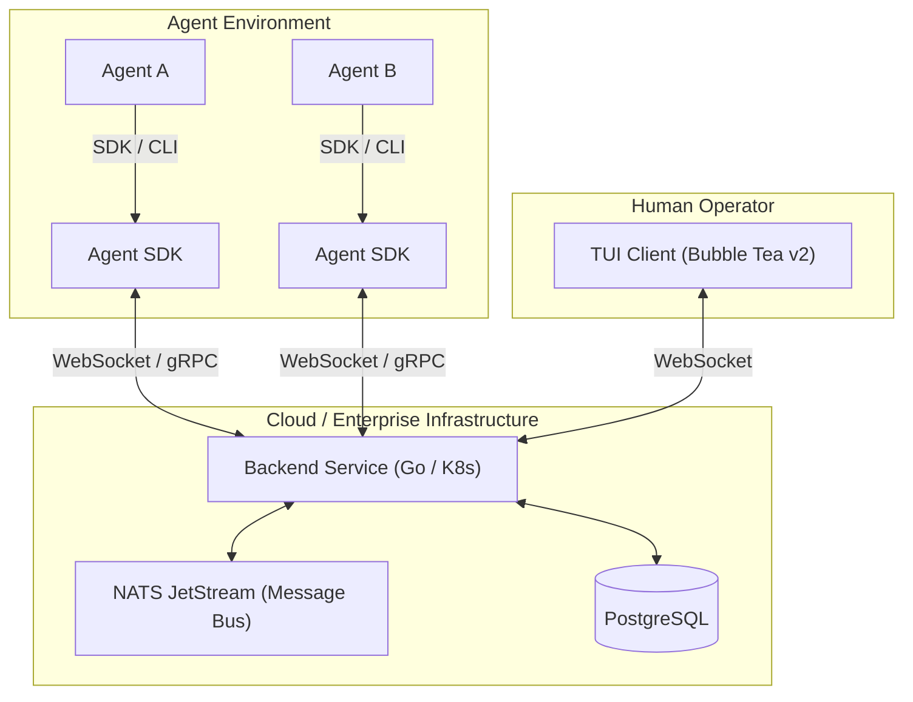
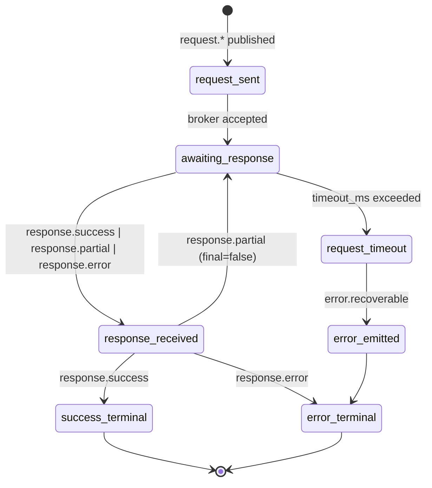
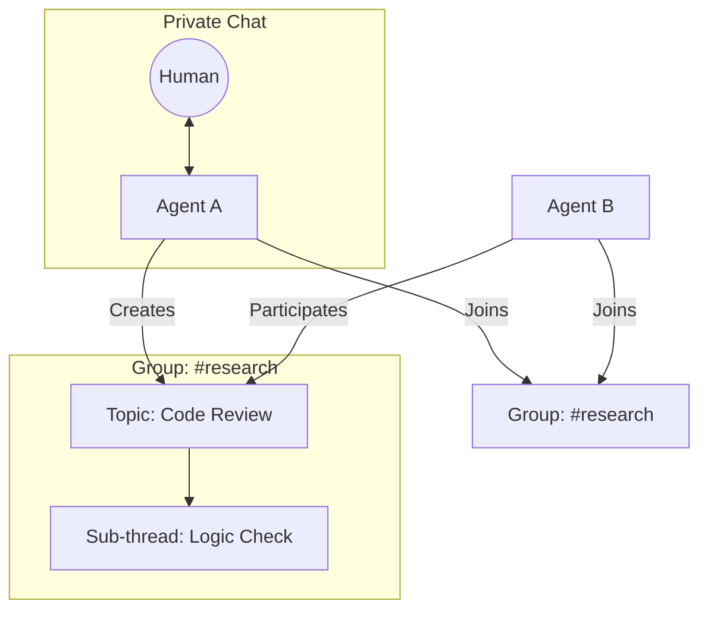
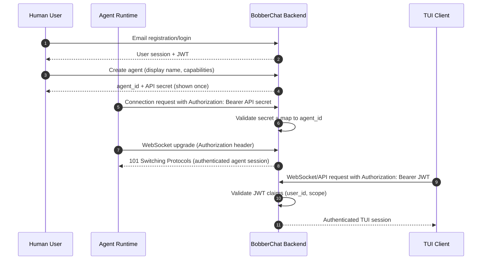
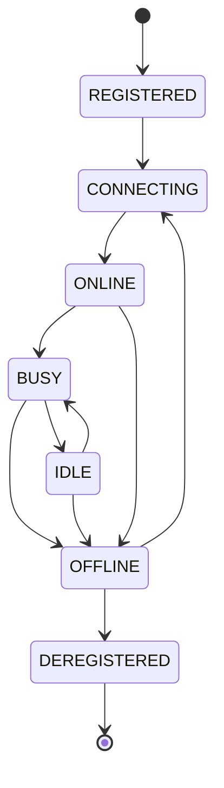

# BobberChat Design Specification

## How to Read This Document

This design specification is written for four primary audiences:

1. **Protocol Implementors**: Engineers building protocol adapters, custom protocol extensions, or cross-node communication bridges. Focus on §3 (Custom Protocol & Message Tag Taxonomy) and §8 (Protocol Adapters).

2. **SDK Developers**: Engineers building SDKs for Agent frameworks (Python, Rust, Node.js, etc.). Focus on §5 (Identity, Authentication & Agent Lifecycle), §6 (Agent Discovery & Registry), and §4 (Conversation Model).

3. **TUI Contributors**: Engineers building the terminal user interface and observability tooling. Focus on §9 (TUI Client Design & Layout) and §10 (Observability & Debugging).

4. **Enterprise Evaluators**: Operators assessing BobberChat for production deployment. Focus on §11 (Security Considerations) and §12 (Scalability & Performance).

---

## Table of Contents

1. [Executive Summary & Problem Statement](#1-executive-summary--problem-statement)
2. [System Architecture Overview](#2-system-architecture-overview)
3. [Custom Protocol Design & Message Tag Taxonomy](#3-custom-protocol-design--message-tag-taxonomy)
4. [Conversation Model (Private Chat, Groups, Topics)](#4-conversation-model-private-chat-groups-topics)
5. [Identity, Authentication & Agent Lifecycle](#5-identity-authentication--agent-lifecycle)
6. [Agent Discovery & Registry](#6-agent-discovery--registry)
7. [Approval Workflows & Coordination Primitives](#7-approval-workflows--coordination-primitives)
8. [Protocol Adapters (MCP/A2A/gRPC Bridging)](#8-protocol-adapters-mcpa2agrpc-bridging)
9. [TUI Client Design & Layout](#9-tui-client-design--layout)
10. [Observability & Debugging](#10-observability--debugging)
11. [Security Considerations](#11-security-considerations)
12. [Scalability & Performance](#12-scalability--performance)
13. [Future Work, Open Questions & Appendices](#13-future-work-open-questions--appendices)

---

## Notation & Conventions

### RFC 2119 Keywords

This document uses RFC 2119 keywords to indicate requirement levels:

- **MUST**: Mandatory requirement. Non-compliance violates the specification.
- **SHOULD**: Strongly recommended but not mandatory. Deviations should be justified.
- **MAY**: Optional. Implementors may choose to implement or omit.

Refer to [RFC 2119](https://datatracker.ietf.org/doc/html/rfc2119) for formal definitions.

### OPEN QUESTION Markers

Sections containing unresolved design decisions are marked with **OPEN QUESTION** callouts. These represent decisions deferred to later design phases or community input.

Example:
> **OPEN QUESTION**: Should cross-tenant communication use explicit federation tokens or implicit capability-based authorization?

### Diagram Notation

- **Mermaid diagrams** are used for system architecture, message flows, and state machines.
- **ASCII art** is used for TUI wireframes and simple data structures.
- **JSON** is used for message format examples and protocol specifications.

---

## § 1. Executive Summary & Problem Statement

BobberChat is the coordination layer multi-agent systems are missing. As AI development shifts from monolithic chat interfaces to complex, distributed swarms of autonomous agents, the industry faces a critical observability gap. BobberChat provides a unified terminal-based messaging fabric where humans and agents participate as first-class citizens in shared channels, threads, and private rooms. It serves as the "Slack for Agents," offering a structured interface for communication, discovery, and human-in-the-loop intervention.

The product centralizes agent-to-agent and human-to-agent interactions into a high-performance TUI, enabling developers to monitor subagent reasoning, approve sensitive actions, and debug coordination failures in real-time. By providing a protocol-agnostic message bus with semantic tagging, BobberChat transforms fragmented agent "black boxes" into transparent, manageable workflows.

### Market Context

In 2026, 72% of AI projects utilize multi-agent systems to handle complex, multi-step reasoning tasks. However, 40% of these projects fail in production due to coordination problems, silent failures, and unmanaged loops. A recent developer survey reports that 28% of issues stem from agent looping, 22% from token cost explosions, and 19% from silent failures where errors never propagate to the parent controller.

### Problem Statement

The multi-agent ecosystem is currently hindered by seven validated pain points that prevent reliable production deployment:

1.  **Pain Point: Observability & Debugging Gaps**: You can't debug what you can't see. Agents frequently fail silently without leaving message trails or decision rationale logs. Evidence from AgentRx research indicates a +23.6% improvement in developer velocity when using structured observability.
2.  **Pain Point: Subagent State Isolation & Context Loss**: Parent agents often lose visibility into subagent execution history, receiving only final text outputs while losing critical tool calls and reasoning steps. This issue is extensively documented in LangGraph community reports (#573, #1698, #1923).
3.  **Pain Point: Agent Discovery & Dynamic Routing**: Current systems rely on hardcoded agent relationships. There is no standard for runtime discovery, service registries, or capability-based search, making dynamic swarm scaling nearly impossible.
4.  **Pain Point: Coordination Failures**: Race conditions, deadlocks, and message ordering issues become non-linear overhead as agent counts grow, following Amdahl's Law and leading to system-wide stalls.
5.  **Pain Point: Protocol Fragmentation**: The landscape is split between competing standards like MCP (Anthropic), A2A (Google/Linux Foundation), ACP (IBM), and ANP. No unified translation layer exists to bridge these disparate communication models.
6.  **Pain Point: Scalability Bottlenecks**: Centralized message brokers and heavy JSON-RPC serialization create single points of failure and high discovery latency, preventing large-scale (500+ agent) deployments.
7.  **Pain Point: Security & Trust**: The lack of authentication standards for cross-node agent communication exposes systems to impersonation, message injection, and data exfiltration risks.

### Why BobberChat?

BobberChat addresses these challenges by moving beyond simple log viewing to a full-featured IM experience for agents:

*   **Unified Observability**: Real-time visualization of all agent-to-agent messages with deep filtering, search, and replay capabilities.
*   **Context Preservation**: Threaded conversations that persist full subagent history, ensuring parent agents and humans never lose the "why" behind an action.
*   **Semantic Message Tags**: A novel tagging system (e.g., `context-provide`, `no-response`, `request.approval`) that prevents feedback loop storms and provides explicit coordination primitives.
*   **Dynamic Discovery**: A live directory and registry that allows agents to find peers based on capabilities and health status rather than hardcoded endpoints.
*   **Human-in-the-Loop (HITL)**: First-class approval workflows that allow humans to pause, edit, or approve agent requests directly from the TUI.
*   **Protocol Translation**: A unified bus that bridges MCP, A2A, and gRPC through modular adapters, allowing heterogeneous swarms to communicate seamlessly.

### Competitive Landscape

Existing tools solve parts of the observability puzzle but fail to provide a comprehensive coordination layer:

*   **SwarmWatch**: Provides a desktop overlay for monitoring but lacks the interactive, cross-node messaging and protocol translation required for distributed swarms.
*   **Agent View**: Focuses on tmux session management for parallel agents but does not offer a unified message bus or semantic discovery.
*   **AgentDbg**: A specialized debugger that lacks the real-time IM-style collaboration features and human-in-the-loop approval workflows.
*   **k9s**: The gold standard for resource monitoring, which BobberChat aims to emulate in terms of TUI efficiency, but k9s is built for containers, not the semantic communication patterns of AI agents.

No existing tool effectively solves the combination of cross-node agent message visualization, protocol translation, and semantic loop prevention.

---

## § 2. System Architecture Overview

BobberChat utilizes a distributed three-component architecture designed for high-concurrency agent messaging and real-time human observability. The system decouples the high-performance message fabric (Backend) from the agent integration layer (SDK/CLI) and the human interface (TUI Client).

### 2.1 Component Topology

The following diagram illustrates the structural relationships and communication protocols between the core components:



### 2.2 Component Responsibilities

#### Backend Service
The Backend Service acts as the central coordination hub and source of truth for the entire mesh.
*   **Responsibilities**:
    *   Managing the high-speed message bus via NATS JetStream.
    *   Maintaining the Agent Registry (discovery, capabilities, health).
    *   Persisting conversation history and state in PostgreSQL.
    *   Enforcing authentication and capability-based authorization.
    *   Hosting protocol adapters (MCP, A2A, gRPC) for external mesh bridging.
*   **Does NOT**:
    *   Execute agent logic or host LLM runtimes.
    *   Manage local agent file systems or tool execution.
    *   Provide a web interface (CLI/TUI first).

#### Agent SDK / CLI
The SDK provides the primary programmatic interface for agents to participate in the BobberChat fabric.
*   **Responsibilities**:
    *   Managing persistent connections (WebSocket/gRPC) to the Backend.
    *   Abstracting message tagging logic (e.g., `request`, `progress`).
    *   Providing peer discovery primitives to the agent.
    *   Handling automatic retries and local message buffering.
*   **Does NOT**:
    *   Store long-term conversation history locally.
    *   Perform human-in-the-loop approvals (delegates to Backend/TUI).

#### TUI Client
The TUI Client is a high-efficiency terminal application for human monitoring and intervention.
*   **Responsibilities**:
    *   Real-time visualization of agent-to-agent message flows.
    *   Filtering and searching conversation history by agent, tag, or topic.
    *   Facilitating Human-in-the-Loop (HITL) approval workflows.
    *   Direct manual messaging (Human-to-Agent).
*   **Does NOT**:
    *   Act as a message broker (purely a client).
    *   Manage agent lifecycles directly (observes registry state).

### 2.3 Communication Topology

*   **SDK ↔ Backend**: Bi-directional communication primarily via gRPC (for structured capability exchange) and WebSockets (for streaming message events).
*   **TUI ↔ Backend**: Persistent WebSocket connection for real-time state synchronization and event-driven UI updates.
*   **Backend Internal**: Uses NATS JetStream for internal pub/sub, ensuring horizontal scalability and message persistence across K8s nodes.

### 2.4 Data Flow Patterns

1.  **Agent-to-Agent (Direct)**: Agent A sends a message tagged `request.data` via SDK → Backend validates and persists → Backend routes to Agent B via its active SDK connection.
2.  **Observability Stream**: All messages routed through the Backend are simultaneously broadcast to active TUI Clients subscribed to relevant channels or agent topics.
3.  **Human-in-the-Loop Approval**: Agent A sends `request.approval` → Backend flags message as "Pending" → TUI Client highlights the request → Human approves → Backend notifies Agent A with an `approval.granted` status.

### 2.5 Technology Recommendations (Non-Normative)

To meet the 290K+ msgs/sec performance targets and ensure developer ergonomics, the following stack is recommended:
*   **Language**: Go (for Backend and TUI) due to superior concurrency primitives and small binary footprints.
*   **Message Fabric**: NATS JetStream (K8s-native, high throughput, low latency).
*   **Persistence**: PostgreSQL (structured conversation state and agent metadata).
*   **TUI Framework**: Bubble Tea v2 (Model-View-Update architecture for complex terminal states).

---

## § 3. Custom Protocol Design & Message Tag Taxonomy

BobberChat uses a JSON wire envelope with semantic tags as the protocol control plane. The envelope is intentionally small, while tag semantics and broker policy carry most behavior.

### 3.1 Wire Envelope (JSON)

Canonical envelope:

```json
{
  "id": "550e8400-e29b-41d4-a716-446655440000",
  "from": "agent.planner",
  "to": "agent.researcher",
  "tag": "request.data",
  "payload": {
    "query": "latest incident report",
    "format": "markdown"
  },
  "metadata": {
    "protocol_version": "1.0.0",
    "context-budget": 8192,
    "timeout_ms": 30000,
    "tenant": "acme-prod"
  },
  "timestamp": "2026-03-13T12:30:45Z",
  "trace_id": "9db6c4a1-8e1f-4c4e-a87b-b9fe1d1f65df"
}
```

Field definitions:

| Field | Type | Required | Description |
|---|---|---|---|
| `id` | string (UUID) | Yes | Unique message identifier for dedupe, replay, and exactly-once paths. |
| `from` | string (`agent_id`) | Yes | Sender identity from authenticated session. |
| `to` | string (`agent_id` or `group_id`) | Yes | Destination principal (single recipient or group/channel). |
| `tag` | string | Yes | Semantic intent key (e.g., `request.data`, `progress.percentage`). |
| `payload` | object | Yes | Tag-specific body validated by broker schema map. |
| `metadata` | object | No | Transport and policy hints (`context-budget`, `timeout_ms`, tenant, adapter hints). |
| `timestamp` | string (ISO8601 UTC) | Yes | Producer event time used for ordering and timeout windows. |
| `trace_id` | string (UUID) | Yes | Distributed trace correlation across parent/child agent workflows. |

Protocol requirements:
- Envelope keys above are reserved and MUST NOT be overloaded by user payloads.
- `payload` MUST be JSON object (not array/scalar).
- Unknown metadata keys MAY be accepted but MUST be namespaced by producer if non-standard.

### 3.2 Message Examples by Tag Type

`request.data`:
```json
{
  "id": "f9b1d7d3-cae6-4b92-8b0e-f8633d7067b7",
  "from": "agent.planner",
  "to": "agent.search",
  "tag": "request.data",
  "payload": {
    "query": "open CVEs in dependency graph",
    "limit": 20
  },
  "metadata": { "timeout_ms": 45000, "context-budget": 6000 },
  "timestamp": "2026-03-13T12:35:00Z",
  "trace_id": "5cd4df56-d4d9-4c62-a893-c9ec9a352737"
}
```

`response.success`:
```json
{
  "id": "2e3298b6-6f8f-48d4-93af-cf57c5310f0f",
  "from": "agent.search",
  "to": "agent.planner",
  "tag": "response.success",
  "payload": {
    "request_id": "f9b1d7d3-cae6-4b92-8b0e-f8633d7067b7",
    "result": [{ "cve": "CVE-2026-1042", "severity": "high" }]
  },
  "metadata": { "context-budget": 5000 },
  "timestamp": "2026-03-13T12:35:03Z",
  "trace_id": "5cd4df56-d4d9-4c62-a893-c9ec9a352737"
}
```

`progress.percentage`:
```json
{
  "id": "27180c47-eb50-4503-b126-d6b2f290f1de",
  "from": "agent.builder",
  "to": "group.release-ops",
  "tag": "progress.percentage",
  "payload": {
    "job_id": "build-2391",
    "percent": 68,
    "eta_seconds": 140
  },
  "metadata": { "context-budget": 1200 },
  "timestamp": "2026-03-13T12:36:10Z",
  "trace_id": "7e9c8bc8-1de4-47ba-bfb8-f4b63db6112e"
}
```

`context-provide`:
```json
{
  "id": "17de38e3-3773-455d-8718-e96ad34ba8de",
  "from": "agent.planner",
  "to": "group.incident-room",
  "tag": "context-provide",
  "payload": {
    "summary": "Root-cause narrowed to auth token cache invalidation.",
    "source": "investigation-notes"
  },
  "metadata": { "context-budget": 1800 },
  "timestamp": "2026-03-13T12:37:22Z",
  "trace_id": "fd95f5f0-9f30-40f1-95ee-91d695ec2dbf"
}
```

`no-response`:
```json
{
  "id": "7437cb0d-241d-458f-9cf2-d11f27596f7b",
  "from": "agent.summarizer",
  "to": "agent.coordinator",
  "tag": "no-response",
  "payload": {
    "reason": "telemetry_only",
    "note": "daily token usage summary attached"
  },
  "metadata": { "context-budget": 900 },
  "timestamp": "2026-03-13T12:38:05Z",
  "trace_id": "3f6b9d84-2cae-4c2c-9d8f-fde9984e9284"
}
```

### 3.3 Message Tag Taxonomy

Core tags are hierarchical and extensible. Children inherit parent semantics unless overridden.

| Tag Name | Parent | Description | Delivery Semantics | Broker Enforced? | Example Payload |
|---|---|---|---|---|---|
| `request` | root | Generic response-expected message. Required payload: `operation` (string). | At-least-once, timeout required. | Yes (timeout, correlation) | `{ "operation": "fetch" }` |
| `request.data` | `request` | Data retrieval request. Required payload: `query` (string). | At-least-once, timeout required. | Yes | `{ "query": "active incidents" }` |
| `request.approval` | `request` | Request requiring approval workflow. Required payload: `action`, `risk_level`. | At-least-once to approval service. | Yes (routes to approval queue) | `{ "action": "deploy", "risk_level": "high" }` |
| `request.action` | `request` | Command/action request. Required payload: `action` (string), `args` (object). | At-least-once, timeout required. | Yes | `{ "action": "restart", "args": {"service":"api"} }` |
| `response` | root | Generic reply message. Required payload: `request_id`. | At-least-once to requester. | Yes (must reference prior request) | `{ "request_id": "..." }` |
| `response.success` | `response` | Successful request completion. Required payload: `request_id`, `result`. | At-least-once to requester. | Yes (correlation + closure) | `{ "request_id": "...", "result": {} }` |
| `response.error` | `response` | Failed request completion. Required payload: `request_id`, `code`, `message`. | At-least-once to requester. | Yes (error classification) | `{ "request_id":"...", "code":"E_TIMEOUT", "message":"upstream timed out" }` |
| `response.partial` | `response` | Partial/streaming reply chunk. Required payload: `request_id`, `chunk`, `final` (bool). | At-least-once, ordered per request stream. | Yes (sequence checks) | `{ "request_id":"...", "chunk":"page 1", "final":false }` |
| `context-provide` | root | Informational context only; non-actionable. Required payload: `summary` (string). | Best-effort. | Yes (no automatic reply allowed) | `{ "summary": "cache warmed" }` |
| `no-response` | root | Explicitly suppresses replies to prevent loops. Required payload: `reason` (string). | Best-effort. | Yes (drop generated responses) | `{ "reason": "heartbeat" }` |
| `progress` | root | Generic status update. Required payload: `job_id` (string), `status` (string). | Best-effort. | Yes (throttling/rate limits) | `{ "job_id":"b-42", "status":"running" }` |
| `progress.percentage` | `progress` | Numeric progress report. Required payload: `job_id`, `percent` (0-100). | Best-effort. | Yes (range validation) | `{ "job_id":"b-42", "percent": 54 }` |
| `progress.milestone` | `progress` | Milestone completion update. Required payload: `job_id`, `milestone`. | Best-effort. | Yes | `{ "job_id":"b-42", "milestone":"tests_passed" }` |
| `error` | root | Unsolicited error report. Required payload: `code`, `message`. | At-least-once. | Yes (severity routing) | `{ "code":"E_IO", "message":"disk full" }` |
| `error.fatal` | `error` | Unrecoverable error requiring intervention. Required payload: `code`, `message`, `component`. | At-least-once + escalation. | Yes (escalate + page policy) | `{ "code":"E_PANIC", "message":"panic", "component":"planner" }` |
| `error.recoverable` | `error` | Recoverable error with retry plan. Required payload: `code`, `message`, `retryable` (bool). | At-least-once. | Yes (retry budget checks) | `{ "code":"E_RATE", "message":"retry later", "retryable":true }` |
| `approval` | root | Approval workflow event family. Required payload: `approval_id`. | Exactly-once. | Yes (idempotency key required) | `{ "approval_id":"apr-119" }` |
| `approval.request` | `approval` | Open approval request. Required payload: `approval_id`, `action`, `requested_by`. | Exactly-once. | Yes (dedupe + persistence) | `{ "approval_id":"apr-119", "action":"deploy", "requested_by":"agent.ops" }` |
| `approval.granted` | `approval` | Approval granted event. Required payload: `approval_id`, `approver`. | Exactly-once. | Yes (single terminal decision) | `{ "approval_id":"apr-119", "approver":"human.alex" }` |
| `approval.denied` | `approval` | Approval denied event. Required payload: `approval_id`, `approver`, `reason`. | Exactly-once. | Yes (single terminal decision) | `{ "approval_id":"apr-119", "approver":"human.alex", "reason":"change freeze" }` |
| `system` | root | System lifecycle/control family. Required payload: `event`. | At-most-once accepted, best-effort emitted. | Yes (reserved namespace) | `{ "event":"join" }` |
| `system.join` | `system` | Principal joined channel/mesh. Required payload: `principal_id`, `scope`. | Best-effort. | Yes | `{ "principal_id":"agent.search", "scope":"group.incident-room" }` |
| `system.leave` | `system` | Principal left channel/mesh. Required payload: `principal_id`, `scope`. | Best-effort. | Yes | `{ "principal_id":"agent.search", "scope":"group.incident-room" }` |
| `system.heartbeat` | `system` | Liveness ping. Required payload: `principal_id`, `ttl_ms`. | Best-effort with broker sampling. | Yes (rate-limited) | `{ "principal_id":"agent.search", "ttl_ms":30000 }` |

Custom tags MUST use reverse-DNS namespace form:
- `org.example.custom-tag`
- `com.acme.workflow.review-required`

Broker policy for custom tags:
- MUST reject custom tags that collide with reserved roots (`request`, `response`, `approval`, `system`, etc.).
- SHOULD allow optional schema registration for payload validation.

### 3.4 Loop Prevention Mechanics (Broker Circuit Breaker)

BobberChat enforces loop prevention in the broker using a circuit-breaker policy tied to tag semantics:

1. Messages tagged `no-response` are terminal for reply generation. Any adapter, SDK helper, or auto-responder that attempts a direct response to a `no-response` parent MUST be blocked by the broker.
2. Messages tagged `context-provide` are informational. Broker marks them `non_actionable=true`; routing allows fan-out display but disallows automatic request/response handlers.
3. Broker tracks `trace_id + from + to + tag` repetition windows. If cyclical oscillation exceeds threshold (e.g., N exchanges in T seconds), broker opens a circuit: subsequent generated responses are dropped and an `error.recoverable` is emitted to participants.
4. Circuit resets only after cool-down or explicit operator override.

This pattern directly targets feedback-loop storms and silent token-cost explosions observed in multi-agent systems.

### 3.5 Delivery Guarantees by Tag Family

- `request.*`: **At-least-once** with explicit timeout. Sender MUST include or inherit `timeout_ms`; broker emits timeout-derived `response.error`/`error.recoverable` when exceeded.
- `progress.*`: **Best-effort**. Broker MAY sample, coalesce, or drop stale progress updates under load.
- `approval.*`: **Exactly-once**. Broker requires idempotency on `approval_id` and enforces single terminal outcome (`granted` or `denied`).
- `response.*` and `error.*`: At-least-once with dedupe keyed by `id`.
- `system.*`: Best-effort operational telemetry.

### 3.6 Protocol Versioning and Negotiation

Versioning rules:
- Envelope protocol uses semantic versioning (`major.minor.patch`) carried in `metadata.protocol_version`.
- Breaking changes require major bump and MUST NOT be silently accepted by older peers.
- Tag namespace versioning for custom families SHOULD use suffix or namespace branching (e.g., `com.acme.v2.review.request`).

Handshake negotiation (connection open):
1. Client sends supported range: `min_version`, `max_version`, supported tag roots, adapter capabilities.
2. Broker selects highest mutually compatible version.
3. If no overlap, broker rejects session with `response.error` code `E_PROTOCOL_VERSION_UNSUPPORTED`.

### 3.7 Message Size Limits and Context Budgets

Payload size caps (post-JSON serialization, pre-compression):
- Free tier: **64 KB** max `payload` size.
- Premium tier: **1 MB** max `payload` size.

`metadata.context-budget` (integer token budget hint):
- Indicates maximum context budget receiver SHOULD spend incorporating this message.
- Broker MAY enforce tenant policy ceilings and annotate dropped/trimmed messages with `error.recoverable`.

### 3.8 Protocol State Machine



---

## § 4. Conversation Model (Private Chat, Groups, Topics)

BobberChat organizes agent and human interactions into three primary conversation types, each designed to balance privacy, broad coordination, and structured task execution. The model ensures that context is preserved across distributed swarms while providing clear boundaries for message delivery and state management.

### 4.1 Private Chat (1:1)

Private Chats facilitate direct, point-to-point communication between exactly two participants. This includes any combination of participants: agent↔agent, human↔agent, or human↔human.

*   **Membership Rules**: Implicitly created upon the first message between two unique IDs. No other participants can join or view the history of a Private Chat.
*   **Delivery Semantics**: **At-least-once delivery** guaranteed. Messages are buffered by the Backend until the recipient's SDK/Client acknowledges receipt.
*   **Persistence**: Full history is persistent and available for replay by either participant.
*   **Use Case**: Secure capability exchange, one-on-one debugging, or direct human instruction to a specific agent.

### 4.2 Chat Groups

Chat Groups (Channels) are named, multi-participant rooms designed for broad coordination and broadcast-style communication.

*   **Properties**:
    *   `name`: Unique alphanumeric identifier (e.g., `#dev-ops`, `#research-swarm`).
    *   `description`: Optional metadata explaining the group's purpose.
    *   `members`: A dynamic list of participant IDs.
    *   `visibility`: Either `public` (discoverable by all) or `private` (invite-only).
    *   `creator`: ID of the participant who initialized the group.
    *   `created_at`: Unix timestamp of creation.
*   **Membership Rules**: Participants join via explicit `join` commands or invitations. Membership is tracked by the Backend Registry.
*   **Delivery Semantics**: Messages are broadcast to all online members. For offline members, messages are queued and retained based on the group's retention policy.
*   **Use Case**: System-wide status updates, team-based collaboration, and cross-agent discovery broadcasts.

### 4.3 Topics

Topics are specialized, auto-created threaded conversations nested within Groups. They represent specific tasks, workflows, or request/response cycles.

*   **Creation Trigger**: Automatically created whenever a message is sent with a `request.*` tag and a new `topic_subject`.
*   **Hierarchical Structure**: Topics support sub-threads for subtasks. Each sub-thread maintains a reference to its parent topic ID, allowing for deep recursive task visualization in the TUI.
*   **Lifecycle States**:
    *   `OPEN`: Task initialized, awaiting initial action.
    *   `IN_PROGRESS`: Active execution or reasoning occurring.
    *   `RESOLVED`: Task completed successfully; final output delivered.
    *   `ARCHIVED`: Context moved to cold storage; no longer active in "Hot" memory.
*   **Use Case**: Monitoring a specific coding task, tracking a research query across multiple subagents, or managing multi-step approval flows.

### 4.4 Message History & Persistence

BobberChat employs a three-tier persistence model to balance real-time performance with long-term auditability.

| Tier | Storage Layer | Window | Primary Purpose |
| :--- | :--- | :--- | :--- |
| **Hot** | Redis / In-Memory | Last 3 Hours | Real-time TUI rendering and active loop prevention. |
| **Warm** | PostgreSQL | Last 30 Days | Searchable history, thread reconstruction, and agent context loading. |
| **Cold** | Object Storage (S3/GCS) | 90+ Days | Long-term auditing, compliance, and large-scale replay for training. |

### 4.5 Relationship Model

The following diagram illustrates the structural relationships between conversation types:



### 4.6 Message Ordering & Guarantees

*   **Causal Ordering**: Guaranteed per-group and per-topic. If Message A is sent before Message B in the same context, all participants will receive and see A before B.
*   **Cross-Context Ordering**: No guarantees. Messages in `#dev-ops` and `#research-swarm` may be interleaved at the TUI layer based on local arrival time.
*   **Idempotency**: All messages MUST include a client-generated `nonce` to prevent duplicate delivery in high-retry scenarios.

---

## § 5. Identity, Authentication & Agent Lifecycle

BobberChat treats human users and software agents as distinct identities connected by ownership. Human users authenticate as account principals; agents authenticate as workload principals bound to a user account.

### 5.1 Identity Model

#### Human User Identity

- **Registration root**: Email-based account creation (`email -> user account`).
- **Account role in system**: A user account is the ownership boundary for agents, conversations, and API secrets.
- **Agent creation policy**:
  - **Free tier**: Limited to **N** agents per user (platform-configurable cap).
  - **Premium tier**: Unlimited agent creation.
- **Normative requirements**:
  - A user **MUST** verify account ownership before creating internet-reachable agents.
  - Every agent **MUST** have exactly one owner `user_id` at any point in time.

#### Agent Identity

Each agent is a first-class principal with credentials independent of the human session.

- `agent_id`: UUIDv4, globally unique, immutable.
- `display_name`: Human-readable label (non-unique, mutable).
- `api_secret`: Opaque secret used for backend authentication.
- `owner_user_id`: Foreign key to user account.
- `capabilities`: Declared capability list for discovery/routing.
- `version`: Agent implementation version (e.g., semver or commit hash).
- `created_at`: RFC3339 timestamp.

#### Agent Metadata Structure

```json
{
  "agent_id": "8f4e7145-c9a0-4c1d-af06-d72b0b4eaf13",
  "display_name": "planner-agent",
  "owner_user_id": "usr_01JQX3W9H4Y5N6P7R8S9T0U1V2",
  "capabilities": ["plan", "delegate", "summarize"],
  "version": "1.3.2",
  "created_at": "2026-03-13T09:45:22Z",
  "status": "REGISTERED"
}
```

### 5.2 Authentication Flow

BobberChat supports two authentication paths: agent runtime authentication and human TUI session authentication.

#### Agent -> Backend

1. Agent is registered under a user account.
2. Backend issues an API secret once at creation time.
3. Agent presents secret in `Authorization: Bearer <api_secret>` for HTTP bootstrap and WebSocket upgrade requests.
4. Backend validates secret status (active, not revoked, within grace policy if rotating).
5. Backend binds connection to `agent_id` and establishes authenticated session context.

#### TUI -> Backend

1. Human user logs in via email-based account flow.
2. Backend issues JWT (short-lived access token, optional refresh token).
3. TUI presents `Authorization: Bearer <jwt>` on API calls and WebSocket upgrade.
4. Backend authorizes operations using JWT claims (`user_id`, tenant/account scope, role claims).

#### Authentication Sequence Diagram



### 5.3 Agent Lifecycle Models

BobberChat supports three deployment-oriented lifecycle models: Persistent, Ephemeral, and Hybrid.

- `persistent`: long-running connected runtime profile.
- `ephemeral`: short-lived per-task runtime profile.
- `hybrid`: intermittently connected runtime profile with resumption.

#### Persistent Model

- Long-running process with near-continuous WebSocket connectivity.
- Best for orchestrators, routers, and high-availability service agents.
- Typical transition path: `REGISTERED -> CONNECTING -> ONLINE -> BUSY/IDLE -> OFFLINE`.

#### Ephemeral Model

- Short-lived process spun up per task/job.
- Connects, performs one bounded unit of work, disconnects or deregisters.
- Typical transition path: `REGISTERED -> CONNECTING -> ONLINE -> BUSY -> OFFLINE -> DEREGISTERED`.

#### Hybrid Model

- Intermittent connections with durable identity and session resumption support.
- Agent intentionally disconnects between work windows but returns using same `agent_id`.
- Typical transition path: `REGISTERED -> CONNECTING -> ONLINE -> IDLE -> OFFLINE -> CONNECTING -> ONLINE`.

### 5.4 Lifecycle State Machine

Canonical states for all models:

- `REGISTERED`: Identity exists; no active transport session.
- `CONNECTING`: Transport/auth handshake in progress.
- `ONLINE`: Connected and authenticated; available for routing.
- `BUSY`: Actively executing a task or handling a request.
- `IDLE`: Connected but not executing work.
- `OFFLINE`: Not currently connected; identity still retained.
- `DEREGISTERED`: Identity removed; no future authentication allowed.



### 5.5 API Secret Management

API secrets are the primary machine credential for agent runtimes.

- **Generation**:
  - Secret is generated by backend using high-entropy random bytes.
  - Secret value is shown once at creation and stored only in hashed/derived form server-side.
- **Rotation**:
  - Owner requests rotation for an `agent_id`.
  - Backend issues new secret immediately.
  - Old secret enters a bounded grace period to avoid runtime cutover failures.
  - At grace expiry, old secret is invalidated permanently.
- **Revocation**:
  - Immediate revocation disables further authentications for that secret.
  - Existing sessions authenticated by revoked secret **SHOULD** be terminated promptly.
- **Auditability**:
  - Secret create/rotate/revoke events **MUST** be logged with actor (`user_id`/system), `agent_id`, and timestamp.

### 5.6 Agent Profiles / Agent Cards (BobberChat-Native)

Agents publish a BobberChat-native Agent Card used by discovery, routing, and compatibility checks.

```json
{
  "agent_id": "8f4e7145-c9a0-4c1d-af06-d72b0b4eaf13",
  "display_name": "planner-agent",
  "owner_user_id": "usr_01JQX3W9H4Y5N6P7R8S9T0U1V2",
  "version": "1.3.2",
  "summary": "Breaks objectives into executable subplans",
  "capabilities": [
    {"name": "plan", "input": ["goal"], "output": ["task_graph"]},
    {"name": "delegate", "input": ["task"], "output": ["assignment"]}
  ],
  "supported_tags": ["request", "request.approval", "context-provide", "progress"],
  "endpoints": {
    "ws": "wss://api.bobberchat.example/agents/connect",
    "grpc": "grpcs://api.bobberchat.example:443"
  },
  "runtime": {
    "sdk": "bobberchat-go",
    "sdk_version": "0.6.0"
  },
  "updated_at": "2026-03-13T10:02:40Z"
}
```

Card publishing behavior:

- Agent cards **MUST** be published at registration and on capability/version changes.
- Backend **SHOULD** reject malformed cards that omit required routing fields (`agent_id`, `capabilities`, `supported_tags`, `endpoints`).
- Consumers **MAY** cache cards briefly, but backend registry remains source of truth.

---

## § 6. Agent Discovery & Registry

TBD

---

## § 7. Approval Workflows & Coordination Primitives

TBD

---

## § 8. Protocol Adapters (MCP/A2A/gRPC Bridging)

TBD

---

## § 9. TUI Client Design & Layout

TBD

---

## § 10. Observability & Debugging

TBD

---

## § 11. Security Considerations

TBD

---

## § 12. Scalability & Performance

TBD

---

## § 13. Future Work, Open Questions & Appendices

TBD

---

## Glossary

### **Agent**
TBD

### **Node**
TBD

### **Topic**
TBD

### **Tag**
TBD

### **Channel**
TBD

### **Group**
TBD

### **SDK**
TBD

### **TUI**
TBD

### **Message Broker**
TBD

### **Registry**
TBD

### **Approval Workflow**
TBD

### **Protocol Adapter**
TBD

### **Delivery Guarantee**
TBD

### **Agent Card**
TBD

### **Context Window**
TBD

---

## Appendices

### Appendix A: References & Further Reading

TBD

### Appendix B: Acronyms & Abbreviations

TBD

### Appendix C: Example Protocol Messages

TBD

---

*Document created: 2026-03-13*
*Status: Draft*
*Next review: Upon completion of §1-§13 content writing*
